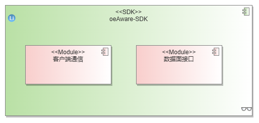

# 1、特性描述

oeAware是面向openEuler自动负载感知加速的框架，具备自动感知场景并加载对应调优能力的功能，目标是希望openEuler所有调优都可以以oeAware为出口，用户可以使用oeAware使能所有调优功能，避免单点特性混杂用户界面混乱，基于该目的，oeAware本身需要具备以下几个特性：

* 解耦：oeAware面对的是一个开放框架，只有足够的松耦合才能应对更复杂的场景，能快速迭代增加支持场景，需要支持闭源模块开发
* 易部署：因为本身是框架，如果部署困难让后续调优基于oeAware做适配几乎不可能，最好配置一个repo源，yum install直接本地安装
* 易使用：给客户面呈现要进行分级，一级界面只有最简洁的接口，一条命令就可以使用
* 易开发：框架类的开发和推广，更需要注重文档质量，需要有简单的sample开发文档，同时该框架定位为动态感知使能，需要有场景复现进行调测定位能力


**约束限制：**

1. 分层交付，单机-集群
2. 模块化交付，支持单组件使用
3. 插件化扩展，通过插件的机制支持缺陷

## 1.1、受益人

| 角色     | 角色描述                                               |
| :------- | :----------------------------------------------------- |
| 运维人员 | 负责机器运维管理的人员                                 |
| 开发者 | 基于oeAware开发加速插件 |

## 1.2、依赖组件

| 组件          | 组件描述                        | 可获得性                        |
| :------------ | :------------------------------ | :------------------------------ |
| libkperf | 轻量级linux性能采集库                    | 使用openEuler repo源yum install|
| log4cplus | c++日志库                    | 使用openEuler repo源yum install |
| systemd   |Linux 系统工具                 | 使用openEuler repo源yum install |
| libboundscheck  | 边界检查函数库 | 使用openEuler repo源yum install |
| strace   | 监视进程与 Linux 内核之间的交互 | 使用openEuler repo源yum install |
| yaml-cpp   | 处理YAML 数据格式 | 使用openEuler repo源yum install |
| curl  | 网站访问软件 | 使用openEuler repo源yum install |

## 1.3、License

Mulan V2

# 2、需求场景分析

## 2.1、上下文/USE-CASE视图

### 2.1.1、oeAware 框架 Use Case


oeAware本身是一个框架，其价值是通过统一的界面入口定义了易接入的标准流程，针对部分无法默认使能的特性，可以动态感知这部分特性的适用场景并自动加载起来，oeAware本身不做加速能力，只定义流程和做框架的公共能力。管理员可以通过管理面接口进行插件的管理(加载、使能等)。同时提供sdk，第三方应用可以利用sdk与oeAware交互，例如订阅oeAware的topic，获取采集的性能数据等。


### 2.1.2、Client、插件管理Use Case


用户可以通过插件管理面接口对插件进行操作，典型场景如图所示：
+ 加载插件
+ 卸载插件
+ 查询插件
+ 使能插件
+ 关闭插件
+ 下载插件

### 2.1.3、SDK Use Case

+ Subscribe：订阅topic，接收来自server的topic的数据并处理。
+ Unsubscribe：取消订阅的topic。
+ Publish：向指定的topic发布数据。


## 2.2、Story分解


| Use  Case   | Story            | 模块     |
|-------- | ---------------- | -------- |
| 服务端框架 | 支持SDK消息处理 | 服务端-SDK |
|          | 支持与客户端的通信       | 服务端-管理 |
|          | 支持插件采集项的开启情况查询 | 服务端-插件管理 |
|          | 支持插件采集项的开启和关闭   | 服务端-插件管理 |
| |支持关键操作的日志记录   | 服务端-日志 |
| 客户端框架 | 支持yaml配置文件的解析 |客户端-命令解析 |
||支持插件启动时传递命令行参数|客户端-命令解析 |
|  | 支持插件的加载和卸载       |客户端-插件管理 |
|          | 支持插件的查询(状态和依赖)       |客户端-插件管理 |
|          | 支持插件的启动和停止 |客户端-插件管理 |
|          | 支持插件的下载安装  |客户端-插件管理 |
| SDK | 支持订阅和取消订阅            ||
|          | 支持发布数据   ||


# 3、模块设计
oeAware 主要分为3个模块，人机界面也就是客户端，是用户和服务端交互的接口。SDK是外部应用和服务端交互的接口。


oeAware 服务端主要分为以下模块
+ 日志管理：维护不同级别的日志
+ 配置管理：对命令行和配置文件解析
+ 持久化管理：当前为日志存储
+ 序列化管理：对插件间交互的数据进行序列化和反序列化
+ 插件管理：管理插件的调度行为、依赖关系
+ 采集插件：采集系统性能数据
+ 感知插件：感知系统特征
+ 调优插件：优化系统性能
+ 服务管理
  + 管理面服务：消息的传递和解析
  + 数据面服务：数据的传递和处理


sdk模块主要分为两部分，一部分是获取数据，一部分是和oeAware服务端进行通信。


## 3.1、服务端设计

### 3.1.1、功能实现
+ 根据消息协议解析来自客户端的消息。
+ 通过消息队列将消息转发到插件管理模块进行处理。
+ 将消息处理结果返回客户端。


server端共有3个线程。
+ 消息转发：负责接收客户端消息，并将消息转发到插件管理线程进行处理
+ 插件管理：处理请求消息，包括插件的加载、卸载、查询、调度
+ 插件调度：处理插件调度消息，完成采集、感知、调优插件的调度

### 3.1.2、UML图


用户通过客户端发送请求，服务端消息转发模块收到消息后，首先根据消息格式对消息进行解析。根据解析的消息类型转发到插件管理模块，由插件管理模块对消息进行处理，并将处理结果返回到消息转发模块。消息转发模块对收到的消息进行封装，最后返回客户端。


+ MessageManager：消息处理类，负责与插件管理模块通信
+ SocketTransport：Socket通信类，通过socket与外部通信。
+ HttpTransport：Http通信类，通过http协议与外部通信。
+ DomainSocket：域套接字类，通过sock file进行tcp通信，适用于单机通信。
+ Socket：套接字类，通过指定ip进行tcp通信。

**Stream实现**

对send和recv进行封装，每次接收4096字节数据，当接收数据小于4096从缓存中读取数据。当接收数据大于4096时，直接通过recv接收全部数据。
命令行客户端通过domain socket进行通信；SDK通过socket进行通信；restful接口通过http进行通信；

**sdk消息处理**
当sdk消息包括订阅、取消订阅、发布。
订阅：当服务端接收到消息时，判断topic是否存在及打开，返回给客户端；如果topic存在，当对应topic产生数据时，将消息推送给sdk。

### 3.1.3、Story分解

| Use Case | Story                        |
| -------- | ---------------------------- |
| 服务端    | 支持SDK消息处理         |
|          | 支持与客户端的通信              |
|          | 支持插件采集项的开启情况查询 |
|          | 支持插件采集项的开启和关闭   |

## 3.2、客户端设计

### 3.2.1、功能实现
+ 通过arg_parse()函数处理程序输入的操作参数，包括加载、卸载、查询、使能插件等操作。
+ 将操作信息通过socket发送到服务端进行处理。
+ 客户端对收到的服务端消息进行处理，并返回给用户。

### 3.2.2、UML图


用户通过客户端执行插件的下载、加载、卸载、删除、使能等操作。客户端首先解析用户执行的命令，如果非法给出错误信息。然后初始化客户端资源，建立与服务端的通信，将用户请求发送到服务端，由服务端处理请求并返回处理结果到客户端。客户端收到服务端消息后，根据消息类型进行相应处理，返回给用户。


+ ArgParse：解析命令行参数，并保存
+ TcpSocket：建立与服务端的tcp连接
+ CmdHandler：处理命令的统一接口
+ xxxHandler：实现CmdHandler来处理具体客户端命令
**消息接口**

| opt             | payload                      | 返回值                                  | 说明             |
| :-------------- | ---------------------------- | --------------------------------------- | ---------------- |
| LOAD            | 插件名称  插件类型           | 执行结果，失败返回原因                  | 加载插件         |
| REMOVE          | 插件名称                     | 执行结果，失败返回原因                  | 卸载插件         |
| QUERY_ALL       | 空                           | 插件名称 <br />        实例名称（状态） | 查询所有插件信息 |
| QUERY           | 插件名称                     | 插件名称 <br />        实例名称（状态） | 查询指定插件信息 |
| ENABLED         | **实例名称,参数1，参数2...** | 执行结果，失败返回原因                  | 使能指定实例     |
| DISABLED        | 实例名称                     | 执行结果，失败返回原因                  | 关闭指定实例     |
| QUERY_DEP       | 实例名称                     | dot语法                                 | 查询实例依赖     |
| QUERY__ALL_DEPS | 空                           | dot语法                                 | 查询所有实例依赖 |
| INSTALL         | 特性名称                     | url                                     | 根据url下载rpm包 |
| LIST            | 空                           | 所有支持的特性和已安装的插件            |                  |
### 3.2.3、Story分解

| Use Case | Story                         |
| -------- | ----------------------------- |
||支持|
| | 支持yaml配置文件的解析|
||支持插件启动时传递命令行参数|
| 插件管理 | 支持插件的加载和卸载       |
|          | 支持插件的查询(状态和依赖)       |
|          | 支持插件的启动和停止 |
|          | 支持插件的下载安装  |

## 3.3、SDK设计

### 3.3.1、功能实现


sdk订阅的数据需要一套标准的数据格式来兼容各种类型的数据类型。

| 属性  | 类型   | 说明                      |
| ----- | ------ | ------------------------- |
| topic | CTopic | 通过topic标识数据类型     |
| len   | uint64 | 数据长度                  |
| data  | void** | void*数组，存储订阅的数据 |

订阅数据需要通过序列化和反序列化的方式，从server发送到sdk。

通过注册机制来完成数据的序列化和反序列化。

每种topic的数据都需要注册对应的序列化和反序列化方法，server在发送时，根据topic将数据序列化；sdk接收到数据时，会根据topic找到对应的反序列化方法，将数据还原。

| 接口                                                    | 参数                                     | 返回值                | 说明                                |
| ------------------------------------------------------- | ---------------------------------------- | --------------------- | ----------------------------------- |
| int OeInit()                                            |                                          | 成功返回0，失败返回-1 | 与server建立连接，并初始化资源      |
| int OeSubscribe(const CTopic *topic, Callback callback) | topic: 订阅的主题<br />callback:回调函数 | 成功返回0，失败返回-1 | 订阅topic的数据，并通过回调函数处理 |
| int OeUnsubscribe(const CTopic *topic)                  | topic: 取消订阅的主题                    | 成功返回0，失败返回-1 | 取消订阅的主题                      |
| int OePublish(const DataList *dataList)                 | dataList：发布的数据                     | 成功返回0，失败返回-1 | 发布数据到插件实例                  |
| void OeClose()                                          |                                          |                       | 释放资源                            |

### 3.3.2、Story分解

| Use Case | Story                |
| -------- | -------------------- |
| SDK | 支持订阅和取消订阅            |
|          | 支持发布数据   |
## 3.4 插件管理设计
### 3.5.1 整体设计分析
插件管理负责插件的加载、卸载、查询、使能等行为。


PluginManager：插件管理类，处理来自消息转发模块的消息。
DepHandler：依赖管理类，管理插件依赖，包括依赖的添加、删除、查询。
MemoryStore：插件存储类，存储插件和实例状态。
InstanceRunHandler：调度队列类，执行插件实例。
Plugin：插件类，保存插件信息。
Instance：实例类，存储实例信息。
Interface：实例接口类。
### 3.5.2 插件加载功能设计
根据插件名称和插件类型加载插件，保存相关插件信息


### 3.5.3 插件卸载功能设计
+ 根据插件名称卸载插件
+ 删除插件，修改涉及实例的状态。


插件卸载时，需要检查插件是否能够卸载：检查实例是否运行。如果满足检查条件，那么就卸载插件，否则卸载失败，并返回失败原因。
### 3.5.4 插件实例使能功能设
通过实例名称使能具体实例。


用户通过命令行发送使能指令，服务端收到消息后，首先通过检查实例名称和状态验证实例是否满足使能条件。加入调度队列进行调度。并将使能结果返回给用户。
### 3.5.5 插件实例关闭功能设计
根据实例名称关闭具体实例


用户通过命令行发送使能指令，服务端收到消息后，首先通过检查实例名称和状态验证其合法性。随后将其关闭，从调度队列中删除。返回用户执行结果。
### 3.5.6 插件调度队列设置
+ 实例按照时间周期进行调度，同一周期内按照优先级进行调度。
+ 实例依赖动态修改。

通过优先级队列进行实例调度执行，优先级
+ 时间小的优先调度
+ 时间相同，优先级小的优先调度
  
每次从队列里调度时，首先检查实例状态，如果实例状态为开启，则对其进行调度执行，然后将其执行时间增加一个周期，重新加入队列，最后检查实例依赖是否发生变化，进行依赖修改；反之，实例状态为关闭，直接将其弹出队列。

**topic订阅**

订阅topic时，如果实例未使能，将其使能，并打开对应topic， (instance)(topic).insert(name); 当topic里为空时调用CloseTopic，当instance为空时，调用Disable
## 3.5 插件实例设计
### 3.5.1 功能实现
每个插件包括多个实例，实例是框架的最小执行单位。

实例类型：采集、感知、调优、单次执行、循环执行。

每个实例包含多个topic，topic作为数据实体被订阅。

实例使用发布-订阅模式获取数据

例如，实例A为采集实例，周期为300ms，实例B为调优实例，周期为1000ms，实例B订阅实例A的topic，两者在同一时刻加入执行队列。假定两者执行时间忽略不计。

从加入队列后，每300ms实例A会把数据发布给实例B。

### 3.5.2 接口设计
**实例属性**

| 属性          | 类型          | 说明                                                         |
| ------------- | ------------- | ------------------------------------------------------------ |
| name          | string        | 实例名称                                                     |
| version       | string        | 实例版本(预留)                                               |
| description   | string        | 实例描述                                                     |
| supportTopics | vector<Topic> | 支持的topic                                                  |
| priority      | int           | 实例执行的优先级 (调优 > 感知 > 采集)                        |
| type          | int           | 实例类型，通过比特位标识，第二位表示单次执行实例，第三位表示采集实例，第四位表示感知实例，第5位表示调优实例 |
| period        | int           | 实例执行周期，单位ms，period为10的倍数                       |

**实例接口**

| 接口                                         | 参数                 | 返回值 | 说明                                                       |
| -------------------------------------------- | -------------------- | ------ | ---------------------------------------------------------- |
| Result OpenTopic(const Topic &topic)         | topic: 打开的主题    |        | 打开对应的topic                                            |
| void CloseTopic(const Topic &topic)          | topic: 关闭的主题    |        | 关闭对应的topic                                            |
| void UpdateData(const DataList &dataList)    | dataList: 订阅的数据 |        | 当订阅topic时，被订阅的topic每周期会通过UpdateData更新数据 |
| Result Enable(const std::string param = "") | param：预留          |        | 使能本实例                                                 |
| void Disable()                               |                      |        | 关闭本实例                                                 |
| void Run()                                   |                      |        | 每周期会执行run函数                                        |


| Use Case | Story                |
| -------- | -------------------- |
| 插件实例 | 支持topic订阅数据            |
|          | 支持按特定周期运行   |
||支持插件运行优先级|

# 4、质量属性设计
## 4.1、性能规格
| 规格名称 | 规格指标 |
| :------- | :------- |
| 内存占用 |  进程内存与实际插件实现有关，oeAware服务<1G        |
| 启动时间 |  服务端启动时间 <1s        |
| 响应时间 |   客户端与服务端交互时间<1s，使能、去使能插件取决于插件实现        |

## 4.2、可靠性设计

使用systemd进行服务管理，设置service文件自动重启以及开机自启动。

## 4.3、 威胁分析
权限 安装oeAware时，创建oeaware用户组，server由root运行。

命令行client只有root用户组可以与server通信；client sock文件权限660，属于root组

sdk：oeaware用户组和root组可以与server通信；sdk sock文件权限660， 属于oeaware组或root组

server的sock文件用于接收来自client和sdk连接，由于sdk可能为oeaware用户组，故server的sock文件权限660；server检查client和sdk各自的sock文件权限，来决定是否接受连接。

通过setfacl命令，为文件增加权限
```shell
setfacl -m g:oeaware:rw /var/run/oeAware/oeAware-server  #增加运行文件夹oeaware组权限
```

## 4.4、 个人数据列表
工具不需要用户个人信息，不涉及用户隐私数据。

## 4.5、兼容性
本系统采用模块化设计，通过模块间参数传递完成业务，新模块不影响已有模块功能。