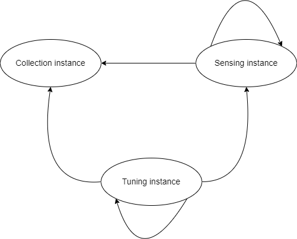
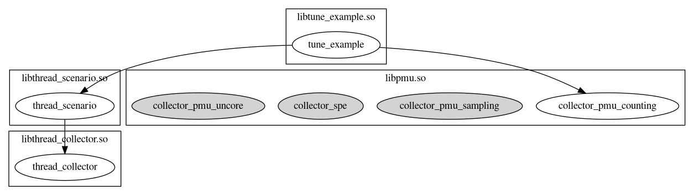
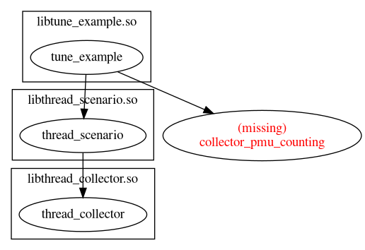

# oeAware User Guide

## Introduction

oeAware is a framework for implementing low-load collection, sensing, and tuning on openEuler. It aims to intelligently enable optimization features after dynamically detecting system behaviors. Traditional optimization features run independently and are statically enabled or disabled. oeAware divides optimization into three layers: collection, sensing, and tuning. Each layer is associated through subscription and is developed as plugins.

## Plugin Description

**Plugin definition**: Each plugin corresponds to an .so file. Plugins are classified into collection plugins, sensing plugins, and tuning plugins.

**Instance definition**: The scheduling unit in the service is instance. A plugin contains multiple instances. For example, a collection plugin includes multiple collection items, and each collection item is an instance.

**Dependencies Between Instances**

Before running an instance, ensure that the dependency between the instances is met.



- A collection instance does not depend on any other instance.

- A sensing instance depends on a collection instance and other sensing instances.

- A tuning instance depends on a collection instance, sensing instance, and other tuning instances.

## Installation

Configure the openEuler Yum repository and run the `yum` commands to install oeAware. on openEuler 22.03 LTS SP4, oeAware has been installed by default.

```shell
yum install oeAware-manager
```

### Service Startup

Run the `systemd` command to start the service.

```shell
systemctl start oeaware
```

Skip this step

Configuration file path: **/etc/oeAware/config.yaml**

```yaml
log_path: /var/log/oeAware # Log storage path
log_level: 1 # Log level. 1: DEBUG; 2: INFO; 3: WARN; 4: ERROR.
enable_list: # Plugins are enabled by default.
  - name: libtest.so # Configure the plugin and enable all instances of the plugin.
  - name: libtest1.so # Configure the plugin and enable the specified plugin instances.
    instances:
    - instance1 
    - instance2
    ...
  ...
plugin_list: # Downloaded packages are supported.
  - name: test #The name must be unique. If the name is repeated, the first occurrence is used.
    description: hello world
    url: https://gitee.com/openeuler/oeAware-manager/raw/master/README.md #url must not be empty.
  ...
```

After modifying the configuration file, run the following commands to restart the service:

```shell
systemctl daemon-reload
systemctl restart oeaware
```

## Usage

Start the oeaware service. Then, manage plugins and instances using the `oeawarectl` command, which supports loading, unloading, and querying plugins, along with enabling, disabling, and querying instances.

### Plugin Loading

By default, the service loads the plugins in the plugin storage paths.

Collection plugin path: /usr/lib64/oeAware-plugin/collector

Sensing plugin path: /usr/lib64/oeAware-plugin/scenario

Tuning plugin path: /usr/lib64/oeAware-plugin/tune

You can also manually load the plugins.

```shell
oeawarectl -l | --load <plugin name> -t | --type <plugin type> # plugin type can be collector, scenario, or tune
```

Example

```shell
[root@localhost ~]# oeawarectl -l libthread_collect.so -t collector
Plugin loaded successfully.
```

If the operation fails, an error description is returned.

### Plugin Unloading

```shell
oeawarectl -r <plugin name> | --remove <plugin name>
```

Example

```shell
[root@localhost ~]# oeawarectl -r libthread_collect.so
Plugin remove successfully.
```

If the operation fails, an error description is returned.

### Plugin Query

#### Querying Plugin Status

```shell
oeawarectl -q # Query all loaded plugins.
oeawarectl --query <plugin name> # Query a specified plugin.
```

Example

```shell
[root@localhost ~]# oeawarectl -q
Show plugins and instances status.
------------------------------------------------------------
libthread_collector.so
        thread_collector(available, close) # Plugin instance and status
libpmu.so
        pmu_cycles_sampling(available, close)
        pmu_cycles_counting(available, close)
        pmu_uncore_counting(available, close)
        pmu_spe_sampling(available, close)
libthread_tune.so
        thread_tune(available, close)
libthread_scenario.so
        thread_scenario(available, close)
------------------------------------------------------------
format:
[plugin]
        [instance]([dependency status], [running status])
dependency status: available means satisfying dependency, otherwise unavailable.
running status: running means that instance is running, otherwise close.
```

If the operation fails, an error description is returned.

#### Querying Plugin Dependencies

```shell
oeawarectl -Q # Query the dependency graph of loaded instances.
oeawarectl --query-dep= <plugin instance> # Query the dependency graph of a specified instance.
```

A **dep.png** file will be generated in the current directory to display the dependencies.

Example

Relationship diagram when dependencies are met



Relationship diagram when dependencies are not met



If the operation fails, an error description is returned.

### Enabling Plugins

#### Enabling a Plugin Instance

```shell
oeawarectl -e | --enable <plugin instance>
```

If the operation fails, an error description is returned.

#### Disabling a Plugin Instance

```shell
oeawarectl -d | --disable <plugin instance>
```

If the operation fails, an error description is returned.

### Downloading and Installing Plugins

Use the `--list` command to query the RPM packages that can be downloaded and installed plugins.

```shell
oeawarectl --list
```

The query result is as follows:

```shell
Supported Packages: # Downloadable packages
[name1] # plugin_list configured in config
[name2]
...
Installed Plugins: # Installed plugins
[name1]
[name2]
...
```

Use the `--install` command to download and install the RPM package.

```shell
oeawarectl -i | --install <RPM package name > # Name of a package queried using --list (package in Supported Packages)
```

If the operation fails, an error description is returned.

### Help

Use the `--help` command for help information.

```shell
usage: oeawarectl [options]...
  options
    -l|--load [plugin]      load plugin and need plugin type.
    -t|--type [plugin_type] assign plugin type. there are three types:
                            collector: collection plugin.
                            scenario: awareness plugin.
                            tune: tune plugin.
    -r|--remove [plugin]    remove plugin from system.
    -e|--enable [instance]  enable the plugin instance.
    -d|--disable [instance] disable the plugin instance.
    -q                      query all plugins information.
    --query [plugin]        query the plugin information.
    -Q                      query all instances dependencies.
    --query-dep [instance]  query the instance dependency.
    --list                  the list of supported plugins.
    -i|--install [plugin]   install plugin from the list.
    --help                  show this help message.
```

## Plugin Development

### Common Data Structures of Plugins

```c
struct DataBuf {
    int len;
    void *data;
};
```

**struct DataBuf** is the data buffer.

- **data**: specific data. **data** is an array. The data type can be defined as required.
- len: size of **data**.

```c
struct DataRingBuf {
    const char *instance_name;
    int index;
    uint64_t count;
    struct DataBuf *buf;
    int buf_len;
};
```

**struct DataRingBuf** facilitates data transfer between plugins, primarily utilizing a circular buffer.

- **instance_name**: instance of the incoming data. For instance, when data reaches a perception plugin, it distinguishes which collection item belongs to which collection plugin.

- **index**: current data write position. For example, after each data collection, the index increments.

- **count**: execution count of the instance, continuously accumulating.

- **buf**: data buffer. Some collection items require multiple samplings before the perception plugin processes them, so the buf array stores these samples.

- **buf_len**: size of the data buffer. Once the buffer is initialized, **buf_len** remains constant.

```C
struct Param {
   const struct DataRingBuf **ring_bufs;
   int len;
};
```

- **ring_bufs**: data required by the instance, sourced from other instances.
- **len**: length of the **ring_bufs** array.

### Instance Interfaces

```C
struct Interface {
    const char* (*get_version)();
    /* The instance name is a unique identifier in the system. */
    const char* (*get_name)();
    const char* (*get_description)();
    /* Specifies the instance dependencies, which is used as the input information
     * for instance execution.
     */
    const char* (*get_dep)();
    /* Instance scheduling priority. In a uniform time period, a instance with a 
     * lower priority is scheduled first.
     */
    int (*get_priority)();
    int (*get_type)();
    /* Instance execution period. */
    int (*get_period)();
    bool (*enable)();
    void (*disable)();
    const struct DataRingBuf* (*get_ring_buf)();
    void (*run)(const struct Param*);
};
```

```c
int get_instance(Interface **interface);
```

Every plugin includes a **get_instance** function to provide instances to the framework.

Obtaining the version number

1. Interface definition

    ```c
    char* (*get_version)();
    ```

2. Interface description

3. Parameter description

4. Return value description

    The specific version number is returned. This interface is reserved.

Obtaining the instance name

1. Interface definition

    ```c
    char* (*get_name)();
    ```

2. Interface description

   Obtains the name of an instance. When you run the `-q` command on the client, the instance name is displayed. In addition, you can run the `--enable` command to enable the instance.

3. Parameter description

4. Return value description

   The name of the instance is returned. Ensure that the instance name is unique.

Obtaining description information

1. Interface definition

   ```c
   char* (*get_description)();
   ```

2. Interface description

3. Parameter description

4. Return value description

   The detailed description is returned. This interface is reserved.

Obtaining the type

1. Interface definition

   ```c
   char* (*get_type)();
   ```

2. Interface description

3. Parameter description

4. Return value description

   The specific type information is returned. This interface is reserved.

Obtaining the sampling period

1. Interface definition

   ```c
   int (*get_cycle)();
   ```

2. Interface description

   Obtains the sampling period. Different collection items can use different collection periods.

3. Parameter description

4. Return value description

   The specific sampling period is returned. The unit is ms.

Obtaining dependencies

1. Interface definition

   ```c
   char* (*get_dep)();
   ```

2. Interface description

3. Parameter description

4. Return value description

   Information about the dependent instances is returned. This interface is reserved.

Enabling an instance

1. Interface definition

   ```c
   void (*enable)();
   ```

2. Interface description

   Enables an instance.

3. Parameter description

4. Return value description

Disabling an instance

1. Interface definition

   ```c
   void (*disable)();
   ```

2. Interface description

   Disables an instance.

3. Parameter description

4. Return value description

Obtaining the data buffer

1. Interface definition

   ```c
   const DataRingBuf* (*get_ring_buf)();
   ```

2. Interface description

   Obtains the buffer management pointer of the collection data (the memory is applied for by the plugin). The pointer is used by sensing plugins.

3. Parameter description

4. Return value description

   The **struct DataRingBuf** management pointer is returned.

Executing an instance

1. Interface definition

   ```c
   void (*run)(const Param*);
   ```

2. Interface description

   Runs at regular intervals according to the execution cycle.

3. Parameter description

   Contains the data necessary for the instance to execute.

4. Return value description

## Supported Plugins

- **libpmu.so**: collects PMU-related data.
- **libthread_collector.so**: gathers thread information within the system.
- **libthread_scenario.so**: monitors details of a specific thread.
- **libthread_tune.so**: enhances UnixBench performance.
- **libsmc_tune.so**: enables SMC acceleration for seamless TCP protocol performance improvements.
- **libtune_numa.so**: optimizes cross-NUMA node memory access to boost system performance.

## Constraints

### Function Constraints

By default, oeAware integrates the libkperf module for collecting Arm microarchitecture information. This module can be called by only one process at a time. If this module is called by other processes or the perf command is used, conflicts may occur.

### Operation Constraints

Currently, only the **root** user can operate oeAware.

## Notes

The user group and permission of the oeAware configuration file and plugins are strictly verified. Do not modify the permissions and user group of oeAware-related files.

Permissions:

- Plugin files: 440

- Client executable file: 750

- Server executable file: 750

- Service configuration file: 640
