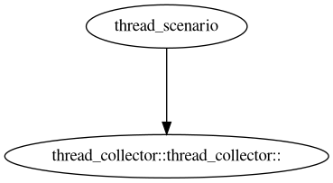

# oeAware User Guide

## Overview

oeAware is a framework that provides low-load collection, sensing, and tuning upon detecting defined system behaviors on openEuler. The framework divides the tuning process into three layers: collection, sensing, and tuning. The three layers are developed as plugins and associated with each other through subscription, overcoming the limitations of traditional tuning features that run independently and are statically enabled or disabled.

## Installation

Configure the openEuler Yum repository and run the `yum` commands to install oeAware. oeAware is installed by default on openEuler 24.03 LTS SP1.

```shell
yum install oeAware-manager
```

## How to Use

Start the oeAware service and then run the `oeawarectl` command to use it.

### Service Startup

Run the `systemd` command to start the service. oeAware is started by default after the installation.

```shell
systemctl start oeaware
```

### Configuration File

The configuration file is stored in `/etc/oeAware/config.yaml`.

```yaml
log_path: /var/log/oeAware # Log storage path.
log_level: 1 # Log level. 1: DEBUG; 2: INFO; 3: WARN; 4: ERROR
enable_list: # The plugin is enabled by default.
   - name: libtest.so # Configure the plugin and enable all instances of the plugin.
   - name: libtest1.so # Configure plugin instances and enable these plugin instances.
     instances:
      - instance1
      - instance2
      ...
   ...
plugin_list: # Plugins you can download.
  - name: test # The name must be unique. If duplicated, the first entry is used.
    description: hello world
    url: https://gitee.com/openeuler/oeAware-manager/raw/master/README.md # url cannot be empty.
  ...
```

After modifying the configuration file, run the following command to restart the service:

```shell
systemctl restart oeaware
```

### Plugin Description

**Plugin definition**: Each plugin corresponds to a .so file. Plugins are classified into collection plugins, sensing plugins, and tuning plugins.

**Instance definition**: Instances are basic units of service scheduling. A plugin contains multiple instances. For example, a collection plugin includes multiple collection items, and each collection item is an instance.

### Plugin Loading

By default, the service loads the plugins from the plugin storage path.

The plugin path is `/usr/lib64/oeAware-plugin/`.

You can also manually load the plugins.

```shell
oeawarectl -l | --load <plugin name>
```

Example:

```shell
[root@localhost ~]# oeawarectl -l libthread_collect.so
Plugin loaded successfully.
```

If the operation fails, an error description is returned.

### Plugin Uninstallation

```shell
oeawarectl -r <plugin name> | --remove <plugin name>
```

Example:

```shell
[root@localhost ~]# oeawarectl -r libthread_collect.so
Plugin remove successfully.
```

If the operation fails, an error description is returned.

### Plugin Query

#### Querying the Plugin Status

```shell
oeawarectl -q # Query all loaded plugins.
oeawarectl --query <plugin name> # Query a specified plugin.
```

Example:

```shell
Show plugins and instances status.
------------------------------------------------------------
libthread_scenario.so
        thread_scenario(available, close, count: 0)
libanalysis_oeaware.so
        hugepage_analysis(available, close, count: 0)
        dynamic_smt_analysis(available, close, count: 0)
        smc_d_analysis(available, close, count: 0)
        xcall_analysis(available, close, count: 0)
        net_hirq_analysis(available, close, count: 0)
        numa_analysis(available, close, count: 0)
        docker_coordination_burst_analysis(available, close, count: 0)
        microarch_tidnocmp_analysis(available, close, count: 0)
libscenario_numa.so
        scenario_numa(available, close, count: 12)
libsystem_tune.so
        stealtask_tune(available, close, count: 0)
        dynamic_smt_tune(available, close, count: 0)
        smc_tune(available, close, count: 0)
        xcall_tune(available, close, count: 0)
        transparent_hugepage_tune(available, close, count: 0)
        seep_tune(available, close, count: 0)
        preload_tune(available, close, count: 0)
        binary_tune(available, close, count: 0)
        numa_sched_tune(available, close, count: 0)
        net_hard_irq_tune(available, close, count: 0)
        multi_net_path_tune(available, close, count: 0)
libdocker_tune.so
        docker_cpu_burst(available, close, count: 0)
        docker_burst(available, close, count: 0)
        load_based_scheduling_tune(available, close, count: 0)
libpmu.so
        pmu_counting_collector(available, close, count: 0)
        pmu_sampling_collector(available, close, count: 12)
        pmu_spe_collector(available, close, count: 12)
        pmu_uncore_collector(available, close, count: 12)
libdocker_collector.so
        docker_collector(available, close, count: 0)
libtune_numa.so
        tune_numa_mem_access(available, close, count: 12)
libub_tune.so
        unixbench_tune(available, close, count: 0)
libsystem_collector.so
        thread_collector(available, close, count: 0)
        kernel_config(available, close, count: 0)
        command_collector(available, close, count: 0)
        env_info_collector(available, close, count: 0)
        net_interface_info(available, close, count: 0)
------------------------------------------------------------
format:
[plugin]
        [instance]([dependency status], [running status], [enable cnt])
dependency status: available means satisfying dependency, otherwise unavailable.
running status: running means that instance is running, otherwise close.
enable cnt: number of instances enabled.
```

If the operation fails, an error description is returned.

#### Querying Tuning Instance Information

```shell
oeawarectl --info
```

Displays the description information and running status of the tunning instance.

#### Querying the Subscription Relationship of Running Instances

```shell
oeawarectl -Q # Query the subscription relationship diagram of all running instances.
oeawarectl --query-dep= <plugin instance> # Query the subscription relationship diagram of the running instances.
```

The `dep.png` file is generated in the current directory, showing the subscription relationship.

The subscription relationship is displayed only when the instances are running.

Example:

```sh
oeawarectl -e thread_scenario
oeawarectl -Q
```



### Plugin Instance Enablement

#### Enabling a Plugin Instance

```shell
oeawarectl -e | --enable <plugin instance>
```

If a plugin instance is enabled, the topic instance subscribed by the plugin instance is also enabled.

If the operation fails, an error description is returned.

You are advised to enable the following plugins:

- libsystem_tune.so: stealtask_tune, smc_tune, xcall_tune, seep_tune
- libub_tune.so: unixbench_tune
- libtune_numa.so: tune_numa_mem_access

Other plugins are mainly used to provide data. You can obtain plugin data through the SDK.

#### Disabling a Plugin Instance

```shell
oeawarectl -d | --disable <plugin instance>
```

If a plugin instance is disabled, the topic instance subscribed by the plugin instance is also disabled.

If the operation fails, an error description is returned.

### Plugin Download and Installation

Run the `--list` command to query the installed plugins and the RPM packages that can be downloaded.

```shell
oeawarectl --list
```

The query result is as follows:

```shell
Supported Packages: # Packages that can be downloaded
[name1] # A plugin listed in the plugin_list in config
[name2]
...
Installed Plugins: # Installed plugins
[name1]
[name2]
...
```

Run the `--install` command to download and install the RPM package.

```shell
oeawarectl -i | --install <RPM package name> # Specify a package name that can be queried using --list (that is, a package listed under Supported Packages).
```

If the operation fails, an error description is returned.

### Analysis Mode

```sh
oeawarectl analysis -h
usage: oeawarectl analysis [options]...
  options
   -t|--time <s>                    set analysis duration in seconds(default 30s), range from 1 to 100.
   -r|--realtime                    show real time report.
   -v|--verbose                     show verbose information.
   -h|--help                        show this help message.
   --l1-miss-threshold              set l1 tlbmiss threshold.
   --l2-miss-threshold              set l2 tlbmiss threshold.
   --out-path                       set the path of the analysis report.
   --dynamic-smt-threshold          set dynamic smt cpu threshold.
   --pid                            set the pid to be analyzed.
   --numa-thread-threshold          set numa sched thread creation threshold.
   --smc-change-rate                set smc connections change rate threshold.
   --smc-localnet-flow              set smc local net flow threshold.
   --host-cpu-usage-threshold       set host cpu usage threshold.
   --docker-cpu-usage-threshold     set docker cpu usage threshold.
```

--`l1-miss-threshold` is used to set the threshold for L1 TLB miss. If the miss rate exceeds this threshold, it is considered high. (Note: The option name is `l1-miss-threshold`, but the description refers to TLB miss. Confirm whether the metric refers to L1 cache miss or L1 TLB miss.)

--`l2-miss-threshold` is used to set the threshold for L2 TLB miss. If the miss rate exceeds this threshold, it is considered high. (Note: The option name is `l2-miss-threshold`, but the description refers to TLB miss. Confirm whether the metric refers to L2 cache miss or L2 TLB miss.)

Example:

Run the following command to generate the system analysis report:

```sh
oeawarectl analysis -t 10
```

The report consists of three parts:

- Data Analysis: analyzes the system performance data based on the system running status.
- Analysis Conclusion: provides the system analysis conclusion.
- Analysis Suggestion: provides the tuning suggestions.

### Help

Run the `--help` command for help information.

```shell
usage: oeawarectl [options]...
  options
    analysis                run analysis mode.
    -l|--load [plugin]      load plugin.
    -r|--remove [plugin]    remove plugin from system.
    -e|--enable [instance]  enable the plugin instance.
    -d|--disable [instance] disable the plugin instance.
    -q                      query all plugins information.
    --query [plugin]        query the plugin information.
    -Q                      query all instances dependencies.
    --query-dep [instance]  query the instance dependency.
    --list                  the list of supported plugins.
    --info                  the list of InfoCmd plugins.
    -i|--install [plugin]   install plugin from the list.
    --reload-conf           reload config file(now only support log level).
    --help                  show this help message.
```

## Plugin Development Description

### Basic Data Structure

```c++
typedef struct {
    char *instanceName; // Instance name
    char *topicName; // Topic name
    char *params; // Parameters
} CTopic;

typedef struct {
    CTopic topic;
    unsigned long long len; // Length of the data array
    void **data; // Stored data
} DataList;

const int OK = 0;
const int FAILED = -1;

typedef struct {
    int code; // If the operation is successful, OK is returned. If the operation fails, FAILED is returned.
    char *payload; // Additional information
} Result;

```

### Instance Base Class

```c++
namespace oeaware {
// Instance type.
const int TUNE = 0b10000;
const int SCENARIO = 0b01000;
const int RUN_ONCE = 0b00010;
class Interface {
public:
    virtual Result OpenTopic(const Topic &topic) = 0;
    virtual void CloseTopic(const Topic &topic) = 0;
    virtual void UpdateData(const DataList &dataList) = 0;
    virtual Result Enable(const std::string &param = "") = 0;
    virtual void Disable() = 0;
    virtual void Run() = 0;
protected:
    std::string name;
    std::string version;
    std::string description;
    std::vector<Topic> supportTopics;
    int priority;
    int type;
    int period;
}
}
```

Each instance is developed by inheriting from the instance base class, implementing six virtual functions, and assigning values to seven class attributes.

The instance uses a Publish-Subscribe pattern, obtaining data through a Subscribe API and publishing data through a Publish API.

### Attribute Description

| Attribute| Type| Description|
| --- | --- | --- |
| name | string | Instance name.|
| version | string | Instance version (reserved).|
| description | string | Instance description.|
| supportTopics | vector\<Topic> | Supported topics.|
| priority | int | Instance execution priority (tuning > awareness > collection).|
| type | int | Instance type, which is identified by bits. The second bit indicates a single execution instance, the third bit indicates a collection instance, the fourth bit indicates an awareness instance, and the fifth bit indicates a tuning instance.|
| period | int | Instance execution period, in milliseconds. The value is a multiple of 10.|

### API Description

| Function Name| Parameter| Return Value| Description|
| --- | --- | --- | --- |
|Result OpenTopic(const Topic &topic) | topic: topic to be opened| | Open the specified topic.|
| void CloseTopic(const Topic &topic) | topic: topic to be closed| |Close the specified topic.|
| void UpdateData(const DataList &dataList) | dataList: subscribed data| | When a topic is subscribed to, this topic updates data through UpdateData every period.|
| Result Enable(const std::string &param = "") | param: reserved for future use| | Enable this instance.|
| void Disable() | | | Disable the instance.|
| void Run() | | | Execute the run function in every period.|

### Instance Example

```C++
#include <oeaware/interface.h>
#include <oeaware/data/thread_info.h>

class Test : public oeaware::Interface {
public:
    Test() {
        name = "TestA";
        version = "1.0";
        description = "this is a test plugin";
        supportTopics;
        priority = 0;
        type = 0;
        period = 20;
    }
    oeaware::Result OpenTopic(const oeaware::Topic &topic) override {
        return oeaware::Result(OK);
    }
    void CloseTopic(const oeaware::Topic &topic) override {

    }
    void UpdateData(const DataList &dataList) override {
        for (int i = 0; i < dataList.len; ++i) {
            ThreadInfo *info = static_cast<ThreadInfo*>(dataList.data[i]);
            INFO(logger, "pid: " << info->pid << ", name: " << info->name);
        }
    }
    oeaware::Result Enable(const std::string &param = "") override {
        // Note that functions such as Subscribe, Publish, and SetDataListTopic are not part of the Interface base class.
        // They may be global functions provided by the framework or need to inherit from another base class. This should be clarified in the documentation.
        Subscribe(oeaware::Topic{"thread_collector", "thread_collector", ""});
        return oeaware::Result(OK);
    }
    void Disable() override {

    }
    void Run() override {
        DataList dataList;
        oeaware::SetDataListTopic(&dataList, "test", "test", "");
        dataList.len = 1;
        dataList.data = new void* [1];
        dataList.data[0] = &pubData;
        Publish(dataList);
    }
private:
    int pubData = 1;
};

extern "C" void GetInstance(std::vector<std::shared_ptr<oeaware::Interface>> &interfaces)
{
    interfaces.emplace_back(std::make_shared<Test>());
}
```

## Internal Plugins

### libpmu.so

| Instance Name| Architecture| Description| Topic|
| --- | --- | --- | --- |
| pmu_counting_collector | AArch64| Collect count events.|cycles, net:netif_rx, L1-dcache-load-misses, L1-dcache-loads, L1-icache-load-misses, L1-icache-loads, branch-load-misses, branch-loads, dTLB-load-misses, dTLB-loads, iTLB-load-misses, iTLB-loads, cache-references, cache-misses, l2d_tlb_refill, l2d_cache_refill, l1d_tlb_refill, l1d_cache_refill, l1d_tlb, l1i_tlb, l1i_tlb_refill, l2d_tlb, l2i_tlb, l2i_tlb_refill, inst_retired, instructions, sched:sched_process_fork, sched:sched_process_exit|
| pmu_sampling_collector | AArch64| Collect sample events.| cycles, skb:skb_copy_datagram_iovec, net:napi_gro_receive_entry|
| pmu_spe_collector | AArch64| Collect SPE events.| spe |
| pmu_uncore_collector | AArch64| Collect uncore events.| uncore |

#### Restrictions

The collection of SPE events depends on the hardware capability. This plugin relies on the BIOS SPE feature. Before running the plugin, you need to enable the SPE.

Run `perf list | grep arm_spe` to check whether the SPE is enabled. If it is enabled, the following information is displayed:

```sh
arm_spe_0//                                      [Kernel PMU event]
```

If not, perform the following steps to enable it:

Go to MISC Config --> SPE in the BIOS. If the SPE is set to `Disable`, switch it to `Enable`. If you cannot find this option, the BIOS version may be outdated.

Access `vim /boot/efi/EFI/openEuler/grub.cfg` of the system, locate the startup item corresponding to the kernel version, and add `kpti=off` to the end of the startup item. Example:

```sh
linux   /vmlinuz-4.19.90-2003.4.0.0036.oe1.aarch64 root=/dev/mapper/openeuler-root ro rd.lvm.lv=openeuler/root rd.lvm.lv=openeuler/swap video=VGA-1:640x480-32@60me rhgb quiet  smmu.bypassdev=0x1000:0x17 smmu.bypassdev=0x1000:0x15 crashkernel=1024M,high video=efifb:off video=VGA-1:640x480-32@60me kpti=off
```

Press **Esc**, enter `:wq`, and press **Enter** to save the change and exit. Run the `reboot` command to restart the server.

### libsystem_collector.so

System information collection plugin

| Instance Name| Architecture| Description| Topic|
| --- | --- | --- | --- |
| thread_collector | AArch64/x86| Collect system thread information.| thread_collector |
| kernel_config | AArch64/x86| Collect kernel parameters, including all sysctl parameters, lscpu, and meminfo.| get_kernel_config, get_cmd, set_kernel_config|
| command_collector | AArch64/x86| Collect sysstat data.| mpstat, iostat, vmstat, sar, pidstat|

### libdocker_collector.so

Docker information collection plugin

| Instance Name| Architecture| Description| Topic|
| --- | --- | --- | --- |
| docker_collector | AArch64/x86| Collect Docker information.| docker_collector |

### libthread_scenario.so

Thread sensing plugin

| Instance Name| Architecture| Description| Subscription|
| --- | --- | --- | --- |
| thread_scenario | AArch64/x86| Obtain the thread information from the configuration file.| thread_collector::thread_collector |

#### Configuration File

thread_scenario.conf

```sh
redis
fstime
fsbuffer
fsdisk
```

### libanalysis_oeaware.so

| Instance Name| Architecture| Description| Subscription|
| --- | --- | --- | --- |
| analysis_aware | AArch64| Analyze service characteristics in the current environment and provide tuning suggestions.| pmu_spe_collector::spe, pmu_counting_collector::net:netif_rx, pmu_sampling_collector::cycles, pmu_sampling_collector::skb:skb_copy_datagram_iovec, pmu_sampling_collector::net:napi_gro_receive_entry |

### libsystem_tune.so

System tuning plugin

| Instance Name| Architecture| Description| Subscription|
| --- | --- | --- | --- |
| stealtask_tune | AArch64| In high-load scenarios, the lightweight search algorithm quickly balances loads across multiple cores, optimizing CPU efficiency.| None|
| smc_tune | AArch64| Enable SMC acceleration to provide transparent acceleration for TCP connections.| None|
| xcall_tune | AArch64| Reduce system call noise to improve system performance.| thread_collector::thread_collector |
| seep_tune | AArch64| Enable the intelligent power mode to reduce system power consumption.| None|
| transparent_hugepage_tune | AArch64/x86| Enable transparent huge pages to reduce the tlb-miss rate.| None|
| preload_tune | AArch64| Load dynamic libraries seamlessly.| None|
| binary_tune | AArch64| Bind special binary files running inside the container to physical CPU cores. Programs that require tuning are identified by parsing specific sections of their ELF files, and CPU affinity is set according to the configuration to improve performance.| env_info::static, env_info::realtime, thread_collector::thread_collector, docker_collector::docker_collector |
| cluster_tune | AArch64| Enable CPU cluster scheduling to optimize performance.| None|
| dynamic_smt_tune | AArch64| In low-load scenarios, physical cores are preferentially allocated to minimize inter-core interference of from hyper-threading.| None|
| numa_sched_tune | AArch64| In scenarios with NUMA bottlenecks, try to schedule threads on the same NUMA node throughout their lifecycle.| None|
| hardirq_tune | AArch64| Bind NIC queue interrupts to the NUMA node where the corresponding workload runs, minimizing cross-NUMA access.| None|
| multi_net_path | AArch64| Perform NIC multipath tunning, ensuring each interrupt processes only the workload on its own NUMA node.| None|

#### Configuration File

##### xcall.yaml

``` yaml
redis: # Thread name
    - xcall_1: 1 # xcall_1 indicates the xcall tunning method. Currently, only xcall_1 is supported, where 1 indicates the system call to be optimized.
mysql:
    - xcall_1: 1
node:
    - xcall_1: 1
```

**Restrictions**: `xcall_tune` depends on kernel features. You need to enable `FAST_SYSCALL` to compile the kernel and add the `xcall` field to the command line.

##### preload.yaml

Path: `/etc/oeAware/preload.yaml`

```yaml
- appname: ""
  so: ""
```

Run the `oeawarectl -e preload_tune` command to load the .so file to the corresponding process based on the configuration file.

### libub_tune.so

UnixBench tuning plugin

| Instance Name| Architecture| Description| Subscription|
| --- | --- | --- | --- |
| unixbench_tune | AArch64/x86| Reduce remote memory access to optimize the UnifiedBus performance.| thread_collector::thread_collector |

### libdocker_tune.so

| Instance Name| Architecture| Description| Subscription|
| --- | --- | --- | --- |
| docker_cpu_burst | AArch64| CPUBurst can temporarily provide additional CPU resources for containers to alleviate performance bottlenecks caused by CPU limits when burst loads occur.| pmu_counting_collector::cycles, docker_collector::docker_collector|
| docker_coordination_burst_tune | AArch64| Detect the CPU quotas of multiple containers and allocate idle CPU resources to containers with insufficient computing power. | None|
| load_based_scheduling_tune | AArch64| For containers whose load exceeds the threshold, load-based scheduling is automatically enabled to distribute resources more evenly across containers.| docker_collector::docker_collector, env_info_collector::static, pmu_sampling_collector::cycles |
| docker_cluster_affinity | AArch64| In a system with a cluster architecture, containers are aware of the cluster architecture and perform scheduling accordingly. They can also monitor CPU load across multiple containers and dynamically adjust quotas between containers to handle resource imbalance.| l3c_hit, docker_collector::docker_collector |

## External Plugins

You can use the following command to install an external plugin, for example, the numafast plugin.

```sh
oeawarectl -i numafast
```

### libscenario_numa.so

| Instance Name| Architecture| Description| Subscription| Topic|
| --- | --- | --- | --- | --- |
| scenario_numa | AArch64| Obtain the cross-NUMA memory access ratio in the current environment. It is used by instances or SDKs through subscription (and cannot be enabled independently).| pmu_uncore_collector::uncore | system_score |

### libtune_numa.so

| Instance Name| Architecture| Description| Subscription|
| --- | --- | --- | --- |
| tune_numa_mem_access | AArch64| Periodically migrate threads and memory to reduce cross-NUMA memory access.| scenario_numa::system_score, pmu_spe_collector::spe, pmu_counting_collector::cycles |

#### tune_numa_mem_access Usage

You can run the `--help` command to view all parameters and their functions of tune_numa_mem_access.

```shell
[root@localhost ~]# oeawarectl -e tune_numa_mem_access -cmd "--help cmd"
Instance enabled failed, because show help message:
Usage: oeaware -e tune_numa_mem_access --cmd "[options][<param>]"
   or vim /etc/numafast.yaml and set options
 attr:c => support conf by cmdline, y => support conf by yaml, r => support reload yaml online
Options:
    -i, --sampling-interval <n>    attr:cy, every sampling interval n msec, range is [100, 100000], default is 100
    -t, --sampling-times <n>       attr:cy, every optimizing have n times sampling, range is [1, 1000] default is 10
    -m, --tune-mode <mode>         attr:cy, tune mode, mode can be [b, t, p], default is b
                                              b: migrate page and thread
                                              t: migrate thread only
                                              p: migrate page only
    -w, --load-way <alg>           attr:cy, load way, can be [b, c], default is b
                                              b: balance the load of threads on all numa nodes
                                              c: centralize processes to fewer numas based on load
        --smt <alg>                attr:cy, smt mode, can be [off, phy-first, load-first], default is phy-first
                                              off: disable smt
                                              phy-first: migrate threads to physical cores first, may limit load
                                              load-first: migrate threads to physical cores based on load, limit load
    -h, --help <type>              attr:c, show help info, type can be [cmd, yaml], default is cmd
    -v, --version                  attr:c, show version info
    -W, --whitelist <process name list>
                                   attr:cy, only migrate process in the list, regexp list split by comma, if not set, migrate all process.
    -b, --blacklist <process name list>
                                   attr:cy, do not migrate process in the list, regexp list split by comma, priority higher than whitelist.
        --precise-load             attr:cy, load control precisely
        --mem-numa-aggregation     attr:cy, process memory aggregate by numa
 other options refer to /etc/numafast.yaml

[root@localhost format]# oeawarectl -e tune_numa_mem_access -cmd "--help yaml"
Instance enabled failed, because show help message:
Usage: vim /etc/numafast.yaml and set options
sampling-interval: <n> # every sampling interval n msec, range is [100, 100000], default is 100
sampling-times: <n> # every optimizing have n times sampling, range is [1, 1000] default is 10
tune-mode: <mode> # tune mode, mode can be [b, t, p], default is b
    # b: migrate page and thread
    # t: migrate thread only
    # p: migrate page only
load-way: <alg> # load way, can be [b, c], default is b
    # b: balance the load of threads on all numa nodes
    # c: centralize processes to fewer numas based on load
smt: <alg> # smt mode, can be [off, phy-first, load-first], default is phy-first
    # off: disable smt
    # phy-first: migrate threads to physical cores first, may limit load
    # load-first: migrate threads to physical cores based on load, limit load
whitelist: [] # only migrate process in the list, regexp list split by comma, if not set, migrate all process.
group: # process affinity group
    # - [process1, process2, ...]
min-numa-score: <n> # min numa score, range is [0 ,1000], default is 955
max-numa-score: <n> # max numa score, range is [0, 1000], default is 975
min-rx-ops-per-ms: <n> # min rx ops per ms, default is 10000
numa-ratio: [] # process initial load distribution for each node
page-reserve: <n> # page reserve, range is [0, 4294967295], default is 100000
precise-load: <true|false> # load control precisely
mem-numa-aggregation: <true|false> # process memory aggregate by numa
process: # process config
    # - name: process1 # process name, /proc/pid/comm
    #   params-regex: "" # process params regex, /proc/pid/cmdline
    #   algorithm: "" # process algorithm, support [MigrateThreadsToOneNode, BalanceProcNum]
    #   migrate-all-memory: "" # migrate all memory, support [true, false]
    #   default-mig-mem-node: "" # default migrate memory node, support [0, numa_node_num - 1]
    #   net-affinity: "" # process net affinity, set net interface name
```

## SDK Instructions

```C
typedef int(*Callback)(const DataList *);
int OeInit(); // Initialize resources and establish a connection with the server.
int OeSubscribe(const CTopic *topic, Callback callback); // Subscribe to a topic and execute the callback asynchronously.
int OeUnsubscribe(const CTopic *topic); // Unsubscribe from a topic.
int OePublish(const DataList *dataList); // Publish data to the server.
void OeClose(); // Release resources.
```

**Example**

```C
#include "oe_client.h"
#include "command_data.h"
int f(const DataList *dataList)
{
    int i = 0;
    for (; i < dataList->len; i++) {
        CommandData *data = (CommandData*)dataList->data[i];
        for (int j = 0; j < data->attrLen; ++j) {
            printf("%s ", data->itemAttr[j]);
        }
        printf("\n");
    }
    return 0;
}
int main() {
    OeInit();
    CTopic topic = {
        "command_collector",
        "sar",
        "-q 1",
    };
    if (OeSubscribe(&topic, f) < 0) {
        printf("failed\n");
    } else {
        printf("success\n");
    }
    sleep(10);
    OeClose();
}
```

## Constraints

### Function Constraints

By default, oeAware integrates the Arm microarchitecture profiling module libkperf. This module can only be accessed by one process at a time. If other processes or tools (such as perf) attempt to use it simultaneously, conflicts may occur.

### Operation Constraints

oeAware only allows operations by users in the root group, while the SDK allows operations by users in both the root and oeaware groups.

## Precautions

oeAware performs strict validation on the configuration files, plugin user groups, and permissions. Do not modify the permissions or user group settings of any oeAware-related file.

Permission description:

- Plugin file: 440

- Client executable file: 750

- Server executable file: 750

- Service configuration file: 640
