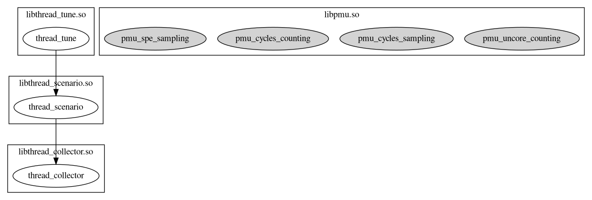

# oeAware用户指南

## 简介

oeAware是在openEuler上实现低负载采集感知调优的框架，目标是动态感知系统行为后智能使能系统的调优特性。传统调优特性都以独立运行且静态打开关闭为主，oeAware将调优拆分采集、感知和调优三层，每层通过订阅方式关联，各层采用插件式开发尽可能复用。

## 安装

配置openEuler的yum源，使用yum命令安装。在openEuler-22.03-LTS-SP4版本中会默认安装。

```shell
yum install oeAware-manager
```

## 使用方法

首先启动oeaware服务，然后通过oeawarectl命令进行使用。

### 服务启动

通过systemd服务启动。安装完成后会默认启动。

```shell
systemctl start oeaware
```

配置文件

配置文件路径:/etc/oeAware/config.yaml

```yaml
log_path: /var/log/oeAware #日志存储路径
log_level: 1 #日志等级 1:DUBUG 2:INFO 3:WARN 4:ERROR
enable_list: #默认使能插件
	- name: libtest.so #只配置插件，使能本插件的所有实例
	- name: libtest1.so #配置插件实例，使能配置的插件实例
	  instances:
		- instance1 
		- instance2
		...
	...
plugin_list: #可支持下载的包
  - name: test #名称需要唯一，如果重复取第一个配置
    description: hello world
    url: https://gitee.com/openeuler/oeAware-manager/raw/master/README.md #url非空
  ...
```

修改配置文件后，通过以下命令重启服务。

```shell
systemctl restart oeaware
```

### 插件说明

**插件定义**：一个插件对应一个.so文件，插件分为采集插件、感知插件和调优插件。

**实例定义**：服务中的调度单位是实例，一个插件中包括多个实例。例如，一个采集插件包括多个采集项，每个采集项是一个实例。

**实例之间依赖关系**

每个实例运行前，需要满足其依赖关系。


- 采集实例不依赖任何其他实例。

- 感知实例依赖采集实例和其他感知实例。

- 调优实例依赖采集实例、感知实例和其他调优实例。

### 插件加载

服务会默认加载插件存储路径下的插件。

插件路径：/usr/lib64/oeAware-plugin/


另外也可以通过手动加载的方式加载插件。

```shell
oeawarectl -l | --load <插件名>
```

示例

```shell
[root@localhost ~]# oeawarectl -l libthread_collect.so
Plugin loaded successfully.
```

失败返回错误说明。

### 插件卸载

```shell
oeawarectl -r <插件名> | --remove <插件名>
```

示例

```shell
[root@localhost ~]# oeawarectl -r libthread_collect.so
Plugin remove successfully.
```

失败返回错误说明。

### 插件查询

#### 查询插件状态信息

```shell
oeawarectl -q  #查询系统中已经加载的所有插件
oeawarectl --query <插件名> #查询指定插件
```

示例

```shell
[root@localhost ~]# oeawarectl -q
Show plugins and instances status.
------------------------------------------------------------
libthread_collector.so
        thread_collector(available, close)
libpmu.so
        pmu_cycles_sampling(available, close)
        pmu_cycles_counting(available, close)
        pmu_uncore_counting(available, close)
        pmu_spe_sampling(available, close)
libthread_tune.so
        thread_tune(available, close)
libthread_scenario.so
        thread_scenario(available, close)
------------------------------------------------------------
format:
[plugin]
        [instance]([dependency status], [running status])
dependency status: available means satisfying dependency, otherwise unavailable.
running status: running means that instance is running, otherwise close.
```

失败返回错误说明。

#### 查询插件依赖

```shell
oeawarectl -Q  #查询已加载实例的依赖关系图
oeawarectl --query-dep= <插件实例>  #查询指定实例依赖关系图
```

在当前目录下生成dep.png，显示依赖关系。

示例

依赖满足下的关系图。


缺少依赖的关系图。


失败返回错误说明。

### 插件实例使能

#### 使能插件实例

```shell
oeawarectl -e | --enable <插件实例>
```

使能某个插件实例，会将其依赖的实例一起使能。

失败返回错误说明。

#### 关闭插件实例

```shell
oeawarectl -d | --disable <插件实例>
```
关闭某个插件实例，会将其依赖的实例（无其他实例依赖）一起关闭。

失败返回错误说明。

### 插件下载安装

通过--list命令查询支持下载的rpm包和已安装的插件。

```shell
oeawarectl --list
```

查询结果如下。

```shell
Supported Packages: #可下载的包
[name1] #config中配置的plugin_list
[name2]
...
Installed Plugins: #已安装的插件
[name1]
[name2]
...
```

通过--install命令下载安装rpm包。

```shell
oeawarectl -i | --install <rpm包名> #指定--list下查询得到的包名称(Supported Packages下的包)
```

失败返回错误说明。
### 帮助
通过--help查看帮助。
```shell
usage: oeawarectl [options]...
  options
    -l|--load [plugin]      load plugin.
    -r|--remove [plugin]    remove plugin from system.
    -e|--enable [instance]  enable the plugin instance.
    -d|--disable [instance] disable the plugin instance.
    -q                      query all plugins information.
    --query [plugin]        query the plugin information.
    -Q                      query all instances dependencies.
    --query-dep [instance]  query the instance dependency.
    --list                  the list of supported plugins.
    -i|--install [plugin]   install plugin from the list.
    --help                  show this help message.
```

## 插件开发

### 插件公共数据结构

```c
struct DataBuf {
    int len;
    void *data;
};
```

struct DataBuf 即数据的buf。

- data：具体的数据，data是一个数组，data的类型可以由插件的开发者自行定义。
- len：data的大小。

```c
struct DataRingBuf {
    const char *instance_name;
    int index;
    uint64_t count;
    struct DataBuf *buf;
    int buf_len;
};
```

struct DataRingBuf 即插件和插件之间传递数据的结构，里面主要是一个循环的buf。

- instance_name ：传入的数据的实例名称。例如当数据传递到感知插件时，用来区分是哪个采集插件的哪个采集项。

- index： 表示当前写入数据的位置。例如某一次数据采集后，index++。

- count：实例的执行次数，一直累加。

- buf： 数据的buf。例如某些采集项要采样多次后才会被感知插件使用，所以用buf数组保存。

- buf_len：数据buf的大小。buf_len在数据buf初始化申请后是固定值。

```C
struct Param {
   const struct DataRingBuf **ring_bufs;
   int len;
};
```
- ring_bufs：实例需要的数据，来自其他实例。
- len：ring_bufs数组的长度。
### 实例接口

```C
struct Interface {
    const char* (*get_version)();
    /* The instance name is a unique identifier in the system. */
    const char* (*get_name)();
    const char* (*get_description)();
    /* Specifies the instance dependencies, which is used as the input information
     * for instance execution.
     */
    const char* (*get_dep)();
    /* Instance scheduling priority. In a uniform time period, a instance with a 
     * lower priority is scheduled first.
     */
    int (*get_priority)();
    int (*get_type)();
    /* Instance execution period. */
    int (*get_period)();
    bool (*enable)();
    void (*disable)();
    const struct DataRingBuf* (*get_ring_buf)();
    void (*run)(const struct Param*);
};
```

```c
int get_instance(Interface **interface);
```

每个插件都有一个get_instance函数，用来向框架输入实例。

获取版本号

1. 接口定义

   ```c
   const char* (*get_version)();
   ```

2. 接口说明

3. 参数说明

4. 返回值说明

   返回具体的版本号，预留。

获取实例名称

1. 接口定义

   ```c
   const char* (*get_name)();
   ```

2. 接口说明

   获取实例名称，客户端`-q`命令查询时会显示实例名称，同时`--enable`命令能够使能该实例。

3. 参数说明

4. 返回值说明

   返回具体的实例名称，必须保证实例名称唯一。

获取描述信息

1. 接口定义

   ```c
   const char* (*get_description)();
   ```

2. 接口说明

3. 参数说明

4. 返回值说明

   返回具体的描述信息，预留。

获取类型

1. 接口定义

   ```c
   int (*get_type)();
   ```

2. 接口说明

3. 参数说明

4. 返回值说明

   返回具体的类型信息，预留。

获取优先级

1. 接口定义

    ```C
    int (*get_priority)();
    ```
    
2. 接口说明

    获取实例优先级。在同一执行周期内，值越小优先级越高。

3. 参数说明

4. 返回值说明

    优先级的值。

获取采样周期

1. 接口定义

   ```c
   int (*get_period)();
   ```

2. 接口说明

   获取执行周期，不同的实例可以使用不同的执行周期。

3. 参数说明

4. 返回值说明

   返回具体的执行周期，单位是ms。

获取依赖

1. 接口定义

   ```c
   const char* (*get_dep)();
   ```

2. 接口说明

3. 参数说明

4. 返回值说明

   返回依赖的实例名称。若有多个依赖实例，则用`-`连接。比如实例C依赖实例”A“和实例”B“，则返回”A-B“（实例名称不允许含有“-”字符）。

使能实例

1. 接口定义

   ```c
   bool (*enable)();
   ```

2. 接口说明

   使能实例。实例执行前的初始化。

3. 参数说明

4. 返回值说明

   使能成功返回true，失败时返回false。

关闭实例

1. 接口定义

   ```c
   void (*disable)();
   ```

2. 接口说明

   关闭实例。实例关闭时，进行资源释放等操作。

3. 参数说明

4. 返回值说明

获取数据buf

1. 接口定义

   ```c
   const DataRingBuf* (*get_ring_buf)();
   ```

2. 接口说明

   获取数据buf管理指针（内存由插件自行申请），由其他实例调用。

3. 参数说明

4. 返回值说明

   返回struct DataRingBuf管理指针。

实例执行

1. 接口定义

   ```c
   void (*run)(const Param*);
   ```

2. 接口说明

   根据执行周期，定期执行。

3. 参数说明

   实例执行时需要的数据。

4. 返回值说明
## 可支持插件列表
- libpmu.so：采集插件，采集pmu相关数据。
- libthread_collector.so：采集插件，采集系统中的线程信息。
- libthread_scenario.so：感知插件，感知某个线程的信息。
- libthread_tune.so:调优插件，对unixbench进行性能调优。
## 约束限制

### 功能约束

oeAware默认集成了arm的微架构采集libkperf模块，该模块同一时间只能有一个进程进行调用，如其他进程调用或者使用perf命令可能存在冲突。

### 操作约束

当前oeAware仅支持root权限用户进行操作。

## 注意事项

oeAware的配置文件和插件用户组和权限有严格校验，不要对oeAware的相关文件进行权限和用户组进行修改。

权限说明：

- 插件文件：440

- 客户端执行文件：750

- 服务端执行文件：750

- 服务配置文件：640
