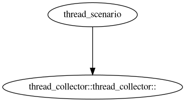

# oeAware用户指南

## 简介

oeAware是在openEuler上实现低负载采集感知调优的框架，目标是动态感知系统行为后智能使能系统的调优特性。传统调优特性都以独立运行且静态打开关闭为主，oeAware将调优拆分采集、感知和调优三层，每层通过订阅方式关联，各层采用插件式开发尽可能复用。

## 安装

配置openEuler的yum源，使用yum命令安装。在openEuler-22.03-LTS-SP4版本中会默认安装。

```shell
yum install oeAware-manager
```

## 使用方法

首先启动oeaware服务，然后通过oeawarectl命令进行使用。

### 服务启动

通过systemd服务启动。安装完成后会默认启动。

```shell
systemctl start oeaware
```

配置文件

配置文件路径:/etc/oeAware/config.yaml

```yaml
log_path: /var/log/oeAware #日志存储路径
log_level: 1 #日志等级 1:DEBUG 2:INFO 3:WARN 4:ERROR
enable_list: #默认使能插件
    - name: libtest.so #只配置插件，使能本插件的所有实例
    - name: libtest1.so #配置插件实例，使能配置的插件实例
      instances:
        - instance1 
        - instance2
        ...
    ...
plugin_list: #可支持下载的包
  - name: test #名称需要唯一，如果重复取第一个配置
    description: hello world
    url: https://gitee.com/openeuler/oeAware-manager/raw/master/README.md #url非空
  ...
```

修改配置文件后，通过以下命令重启服务。

```shell
systemctl restart oeaware
```

### 插件说明

**插件定义**：一个插件对应一个.so文件，插件分为采集插件、感知插件和调优插件。

**实例定义**：服务中的调度单位是实例，一个插件中包括多个实例。例如，一个采集插件包括多个采集项，每个采集项是一个实例。

### 插件加载

服务会默认加载插件存储路径下的插件。

插件路径：/usr/lib64/oeAware-plugin/

另外也可以通过手动加载的方式加载插件。

```shell
oeawarectl -l | --load <插件名>
```

示例

```shell
[root@localhost ~]# oeawarectl -l libthread_collect.so
Plugin loaded successfully.
```

失败返回错误说明。

### 插件卸载

```shell
oeawarectl -r <插件名> | --remove <插件名>
```

示例

```shell
[root@localhost ~]# oeawarectl -r libthread_collect.so
Plugin remove successfully.
```

失败返回错误说明。

### 插件查询

#### 查询插件状态信息

```shell
oeawarectl -q  #查询系统中已经加载的所有插件
oeawarectl --query <插件名> #查询指定插件
```

示例

```shell
[root@localhost ~]# oeawarectl -q
Show plugins and instances status.
------------------------------------------------------------
libsystem_tune.so
        stealtask_tune(available, close, count: 0)
        smc_tune(available, close, count: 0)
        xcall_tune(available, close, count: 0)
        seep_tune(available, close, count: 0)
libpmu.so
        pmu_counting_collector(available, close, count: 0)
        pmu_sampling_collector(available, close, count: 0)
        pmu_spe_collector(available, close, count: 0)
        pmu_uncore_collector(available, close, count: 0)
libdocker_tune.so
        docker_cpu_burst(available, close, count: 0)
libthread_scenario.so
        thread_scenario(available, close, count: 0)
libsystem_collector.so
        thread_collector(available, close, count: 0)
        kernel_config(available, close, count: 0)
        command_collector(available, close, count: 0)
libdocker_collector.so
        docker_collector(available, close, count: 0)
libub_tune.so
        unixbench_tune(available, close, count: 0)
libanalysis_oeaware.so
        analysis_aware(available, close, count: 0)
------------------------------------------------------------
format:
[plugin]
        [instance]([dependency status], [running status], [enable cnt])
dependency status: available means satisfying dependency, otherwise unavailable.
running status: running means that instance is running, otherwise close.
enable cnt: number of instances enabled.
```

失败返回错误说明。

#### 查询运行实例订阅关系

```shell
oeawarectl -Q  #查询已加载实例的订阅关系图
oeawarectl --query-dep= <插件实例>  #查询指定实例订阅关系图
```

在当前目录下生成dep.png，显示订阅关系。

示例

```sh
oeawarectl -e thread_scenario
oeawarectl -Q
```



### 插件实例使能

#### 使能插件实例

```shell
oeawarectl -e | --enable <插件实例>
```

使能某个插件实例，会将其依赖的实例一起使能。

失败返回错误说明。

#### 关闭插件实例

```shell
oeawarectl -d | --disable <插件实例>
```

关闭某个插件实例，会将其依赖的实例（无其他实例依赖）一起关闭。

失败返回错误说明。

### 插件下载安装

通过--list命令查询支持下载的rpm包和已安装的插件。

```shell
oeawarectl --list
```

查询结果如下。

```shell
Supported Packages: #可下载的包
[name1] #config中配置的plugin_list
[name2]
...
Installed Plugins: #已安装的插件
[name1]
[name2]
...
```

通过--install命令下载安装rpm包。

```shell
oeawarectl -i | --install <rpm包名> #指定--list下查询得到的包名称(Supported Packages下的包)
```

失败返回错误说明。

### 帮助

通过--help查看帮助。

```shell
usage: oeawarectl [options]...
  options
    -l|--load [plugin]      load plugin.
    -r|--remove [plugin]    remove plugin from system.
    -e|--enable [instance]  enable the plugin instance.
    -d|--disable [instance] disable the plugin instance.
    -q                      query all plugins information.
    --query [plugin]        query the plugin information.
    -Q                      query all instances dependencies.
    --query-dep [instance]  query the instance dependency.
    --list                  the list of supported plugins.
    -i|--install [plugin]   install plugin from the list.
    --help                  show this help message.
```

## 插件开发说明

### 基础数据结构

```c++
typedef struct {
    char *instanceName; // 实例名称
    char *topicName; // 主题名称
    char *params; // 参数
} CTopic;

typedef struct {
    CTopic topic;
    unsigned long long len; // data数组的长度
    void **data; // 存储的数据
} DataList;

const int OK = 0;
const int FAILED = -1;

typedef struct {
    int code; // 成功返回OK，失败返回FAILED
    char *payload; // 附带信息
} Result;

```

### 实例基类

```c++
namespace oeaware {
// Instance type.
const int TUNE = 0b10000;
const int SCENARIO = 0b01000;
const int RUN_ONCE = 0b00010;
class Interface {
public:
    virtual Result OpenTopic(const Topic &topic) = 0;
    virtual void CloseTopic(const Topic &topic) = 0;
    virtual void UpdateData(const DataList &dataList) = 0;
    virtual Result Enable(const std::string &param = "") = 0;
    virtual void Disable() = 0;
    virtual void Run() = 0;
protected:
    std::string name;
    std::string version;
    std::string description;
    std::vector<Topic> supportTopics;
    int priority;
    int type;
    int period;
}
}
```

实例开发继承实例基类，实现6个虚函数，并对类的7个属性赋值。

**属性说明**

| 属性 | 类型 | 说明 |
| --- | --- | --- |
| name | string | 实例名称 |
| version | string | 实例版本(预留) |  
| description | string | 实例描述 |
| supportTopics | vector&lt;Topic&gt;| 支持的topic |
| priority | int | 实例执行的优先级 (调优 > 感知 > 采集)| 
| type | int | 实例类型，通过比特位标识，第二位表示单次执行实例，第三位表示采集实例，第四位表示感知实例，第5位表示调优实例|
| period | int | 实例执行周期，单位ms，period为10的倍数 | 

**虚函数说明**

| 函数名 | 参数 | 返回值 | 说明 |
| --- | --- | --- | --- | 
|Result OpenTopic(const Topic &topic) | topic: 打开的主题 | | 打开对应的topic |
| void CloseTopic(const Topic &topic) | topic: 关闭的主题| |关闭对应的topic |
| void UpdateData(const DataList &dataList) | dataList: 订阅的数据 | | 当订阅topic时，被订阅的topic每周期会通过UpdateData更新数据 |
| Result Enable(const std::string &param = "") | param：预留 | | 使能本实例 |
| void Disable() | | | 关闭本实例 |
| void Run() | | | 每周期会执行run函数 |

## 可支持插件列表

### libpmu.so

采集pmu相关数据。

- **pmu_counting_collector**: 采集count相关事件，包括"cycles", "net:netif_rx", "L1-dcache-load-misses", "L1-dcache-loads", "L1-icache-load-misses", "L1-icache-loads", "branch-load-misses", "branch-loads","dTLB-load-misses", "dTLB-loads", "iTLB-load-misses", "iTLB-loads", "cache-references", "cache-misses", "l2d_tlb_refill", "l2d_cache_refill", "l1d_tlb_refill", "l1d_cache_refill", "inst_retired", "instructions"。

- **pmu_sampling_collector**: 采集sample相关事件，包括"cycles",  "skb:skb_copy_datagram_iovec", "net:napi_gro_receive_entry"。
- **pmu_spe_collector**: 采集spe事件。
- **pmu_uncore_collector**: 采集uncore事件。

### libsystem_collector.so

系统信息采集插件。

- **thread_collector**: 采集系统中的线程信息。

- **kernel_config**: 采集内核相关参数，包括sysctl所有参数、lscpu、meminfo等。

- **command_collector**: 采集iostat，mpstat，vmstat，pidstat，sar等相关数据。

### libdocker_collector.so

docker信息采集插件。

- **docker_collector**: 采集docker相关信息。

### libthread_scenario.so

线程感知插件。

- **thread_scenario**：通过白名单获取对应线程信息。
    
    白名单配置 thread_scenario.conf,每一行代表线程名。

    ```yaml
    redis
    fstime
    fsbuffer
    fsdisk
    ```

### libsystem_tune.so

系统调优插件。

- **stealtask_tune**: 高负载场景下，通过轻量级搜索算法，实现多核间快速负载均衡，最大化cpu资源利用率。

- **smc_tune**: 使能smc加速，对使用tcp协议的连接无感加速。

- **xcall_tune**: 通过减少系统调用底噪，提升系统性能。

    xcall配置文件：

    ``` yaml
    redis: # 线程名称
        - xcall_1: 1 #xcall_1表示xcall优化方式，目前只有xcall_1; 1表示需要优化系统调用号
    mysql:
        - xcall_1: 1
    node:
        - xcall_1: 1
    ```

- **seep_tune**: 使能智能功耗模式，降低系统能耗。

### libub_tune.so

unixbench调优插件。

- **unixbench_tune**：通过减少远端内存访问，优化ub性能。

## SDK使用说明

```C
typedef int(*Callback)(const DataList *);
int OeInit(); // 初始化资源，与server建立链接
int OeSubscribe(const CTopic *topic, Callback callback); // 订阅topic，异步执行callback
int OeUnsubscribe(const CTopic *topic); // 取消订阅topic
int OePublish(const DataList *dataList); // 发布数据到server
void OeClose(); // 释放资源
```

**示例**

```C
#include "oe_client.h"
#include "command_data.h"
int f(const DataList *dataList)
{
    int i = 0;
    for (; i < dataList->len; i++) {
        CommandData *data = (CommandData*)dataList->data[i];
        for (int j = 0; j < data->attrLen; ++j) {
            printf("%s ", data->itemAttr[j]);
        }
        printf("\n");
    }
    return 0;
}
int main() {
    OeInit();
    CTopic topic = {
        "command_collector",
        "sar",
        "-q 1",
    };
    if (OeSubscribe(&topic, f) < 0) {
        printf("failed\n");
    } else {
        printf("success\n");
    }
    sleep(10);
    OeClose();
}
```

## 约束限制

### 功能约束

oeAware默认集成了arm的微架构采集libkperf模块，该模块同一时间只能有一个进程进行调用，如其他进程调用或者使用perf命令可能存在冲突。

### 操作约束

当前oeAware仅支持root组用户进行操作, sdk支持root组和oeaware组用户使用。

## 注意事项

oeAware的配置文件和插件用户组和权限有严格校验，不要对oeAware的相关文件进行权限和用户组进行修改。

权限说明：

- 插件文件：440

- 客户端执行文件：750

- 服务端执行文件：750

- 服务配置文件：640
