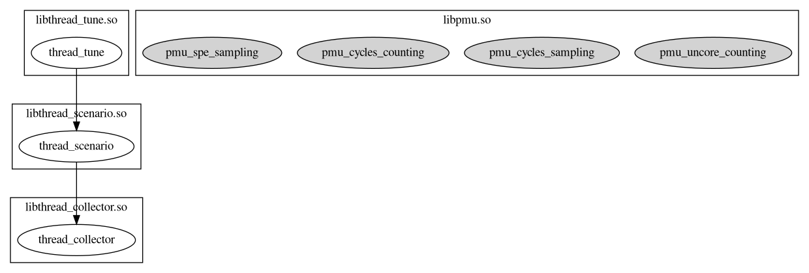

# oeAware用户指南

## 简介

oeAware是在openEuler上实现低负载采集感知调优的框架，目标是动态感知系统行为后智能使能系统的调优特性。传统调优特性都以独立运行且静态打开关闭为主，oeAware将调优拆分采集、感知和调优三层，每层通过订阅方式关联，各层采用插件式开发尽可能复用。

## 安装

配置openEuler的yum源，使用yum命令安装。在openEuler-22.03-LTS-SP4版本中会默认安装。

```shell
yum install oeAware-manager
```

## 使用方法

首先启动oeaware服务，然后通过`oeawarectl`命令进行使用。

### 服务启动

通过systemd服务启动。安装完成后会默认启动。

```shell
systemctl start oeaware
```

### 配置文件

配置文件路径：`/etc/oeAware/config.yaml`。

```yaml
log_path: /var/log/oeAware #日志存储路径
log_level: 1 #日志等级 1：DEBUG 2：INFO 3：WARN 4：ERROR
enable_list: #默认使能插件
   - name: libtest.so #只配置插件，使能本插件的所有实例
   - name: libtest1.so #配置插件实例，使能配置的插件实例
     instances:
      - instance1 
      - instance2
      ...
   ...
plugin_list: #可支持下载的包
  - name: test #名称需要唯一，如果重复取第一个配置
    description: hello world
    url: https://gitee.com/openeuler/oeAware-manager/raw/master/README.md #url非空
  ...
```

修改配置文件后，通过以下命令重启服务。

```shell
systemctl restart oeaware
```

### 插件说明

**插件定义**：一个插件对应一个`.so`文件，插件分为采集插件、感知插件和调优插件。

**实例定义**：服务中的调度单位是实例，一个插件中包括多个实例。例如，一个采集插件包括多个采集项，每个采集项是一个实例。

### 插件加载

服务会默认加载插件存储路径下的插件。

插件路径：`/usr/lib64/oeAware-plugin/`。

另外也可以通过手动加载的方式加载插件。

```shell
oeawarectl -l | --load <插件名>
```

示例：

```shell
[root@localhost ~]# oeawarectl -l libthread_collect.so
Plugin loaded successfully.
```

失败返回错误说明。

### 插件卸载

```shell
oeawarectl -r <插件名> | --remove <插件名>
```

示例：

```shell
[root@localhost ~]# oeawarectl -r libthread_collect.so
Plugin remove successfully.
```

失败返回错误说明。

### 插件查询

#### 查询插件状态信息

```shell
oeawarectl -q  #查询系统中已经加载的所有插件
oeawarectl --query <插件名> #查询指定插件
```

示例：

```shell
Show plugins and instances status.
------------------------------------------------------------
libpmu.so
    pmu_counting_collector(available, close, count: 0)
    pmu_sampling_collector(available, close, count: 0)
    pmu_spe_collector(available, close, count: 0)
    pmu_uncore_collector(available, close, count: 0)
libdocker_tune.so
    docker_cpu_burst(available, close, count: 0)
    docker_burst(available, close, count: 0)
libsystem_tune.so
    stealtask_tune(available, close, count: 0)
    dynamic_smt_tune(available, close, count: 0)
    smc_tune(available, close, count: 0)
    xcall_tune(available, close, count: 0)
    transparent_hugepage_tune(available, close, count: 0)
    seep_tune(available, close, count: 0)
    preload_tune(available, close, count: 0)
    binary_tune(available, close, count: 0)
    numa_sched_tune(available, close, count: 0)
    realtime_tune(available, close, count: 0)
    net_hard_irq_tune(available, close, count: 0)
    multi_net_path_tune(available, close, count: 0)
libdocker_collector.so
    docker_collector(available, close, count: 0)
libsystem_collector.so
    thread_collector(available, close, count: 0)
    kernel_config(available, close, count: 0)
    command_collector(available, close, count: 0)
    env_info_collector(available, close, count: 0)
    net_interface_info(available, close, count: 0)
libub_tune.so
    unixbench_tune(available, close, count: 0)
libthread_scenario.so
    thread_scenario(available, close, count: 0)
libanalysis_oeaware.so
    hugepage_analysis(available, close, count: 0)
    dynamic_smt_analysis(available, close, count: 0)
    smc_d_analysis(available, close, count: 0)
    xcall_analysis(available, close, count: 0)
    net_hirq_analysis(available, close, count: 0)
    numa_analysis(available, close, count: 0)
    docker_coordination_burst_analysis(available, close, count: 0)
    microarch_tidnocmp_analysis(available, close, count: 0)
------------------------------------------------------------
format:
[plugin]
    [instance]([dependency status], [running status], [enable cnt])
dependency status: available means satisfying dependency, otherwise unavailable.
running status: running means that instance is running, otherwise close.
enable cnt: number of instances enabled.
```

失败返回错误说明。

#### 查询调优实例信息

```shell
oeawarectl --info
```

显示调优实例描述信息及运行状态。

#### 查询运行实例订阅关系

```shell
oeawarectl -Q  #查询所有运行实例的订阅关系图
oeawarectl --query-dep= <插件实例>  #查询运行实例订阅关系图
```

在当前目录下生成dep.png，显示订阅关系。

实例未运行，不会显示订阅关系。

示例：

```sh
oeawarectl -e thread_scenario
oeawarectl -Q
```



### 插件实例使能

#### 使能插件实例

```shell
oeawarectl -e | --enable <插件实例>
```

使能某个插件实例，会将其订阅的topic实例一起使能。

失败返回错误说明。

推荐使能插件列表：

- libsystem_tune.so：stealtask_tune，smc_tune，xcall_tune，seep_tune。
- libub_tune.so：unixbench_tune。
- libtune_numa.so：tune_numa_mem_access。

其他插件主要用来提供数据，可通过sdk获取插件数据。

#### 关闭插件实例

```shell
oeawarectl -d | --disable <插件实例>
```

关闭某个插件实例，会将其订阅的topic实例一起关闭。

失败返回错误说明。

### 插件下载安装

通过`--list`命令查询支持下载的rpm包和已安装的插件。

```shell
oeawarectl --list
```

查询结果如下。

```shell
Supported Packages: #可下载的包
[name1] #config中配置的plugin_list
[name2]
...
Installed Plugins: #已安装的插件
[name1]
[name2]
...
```

通过`--install`命令下载安装rpm包。

```shell
oeawarectl -i | --install <rpm包名> #指定--list下查询得到的包名称（Supported Packages下的包）
```

失败返回错误说明。

### 分析模式

```sh
oeawarectl analysis -h
usage: oeawarectl analysis [options]...
  options
   -t|--time <s>                    set analysis duration in seconds(default 30s), range from 1 to 100.
   -r|--realtime                    show real time report.
   -v|--verbose                     show verbose information.
   -h|--help                        show this help message.
   --l1-miss-threshold              set l1 tlbmiss threshold.
   --l2-miss-threshold              set l2 tlbmiss threshold.
   --out-path                       set the path of the analysis report.
   --dynamic-smt-threshold          set dynamic smt cpu threshold.
   --pid                            set the pid to be analyzed.
   --numa-thread-threshold          set numa sched thread creation threshold.
   --smc-change-rate                set smc connections change rate threshold.
   --smc-localnet-flow              set smc local net flow threshold.
   --host-cpu-usage-threshold       set host cpu usage threshold.
   --docker-cpu-usage-threshold     set docker cpu usage threshold.
```

--l1-miss-threshold用于设置l1-tlb—miss阈值，超过这个阈值miss率为high。

--l2-miss-threshold用于设置l2-tlb—miss阈值，超过这个阈值miss率为high。

示例：

执行以下命令，输出系统分析报告。

```sh
oeawarectl analysis -t 10
```

报告分为三部分：

- Data Analysis：根据系统运行状态，给出系统性能数据分析。
- Analysis Conclusion：给出系统分析结论。
- Analysis Suggestion：给出具体调优方法。

### 帮助

通过`--help`查看帮助。

```shell
usage: oeawarectl [options]...
  options
    analysis                run analysis mode.
    -l|--load [plugin]      load plugin.
    -r|--remove [plugin]    remove plugin from system.
    -e|--enable [instance]  enable the plugin instance.
    -d|--disable [instance] disable the plugin instance.
    -q                      query all plugins information.
    --query [plugin]        query the plugin information.
    -Q                      query all instances dependencies.
    --query-dep [instance]  query the instance dependency.
    --list                  the list of supported plugins.
    --info                  the list of InfoCmd plugins.
    -i|--install [plugin]   install plugin from the list.
    --help                  show this help message.
```

## 插件开发说明

### 基础数据结构

```c++
typedef struct {
    char *instanceName; // 实例名称
    char *topicName; // 主题名称
    char *params; // 参数
} CTopic;

typedef struct {
    CTopic topic;
    unsigned long long len; // data数组的长度
    void **data; // 存储的数据
} DataList;

const int OK = 0;
const int FAILED = -1;

typedef struct {
    int code; // 成功返回OK，失败返回FAILED
    char *payload; // 附带信息
} Result;

```

### 实例基类

```c++
namespace oeaware {
// Instance type.
const int TUNE = 0b10000;
const int SCENARIO = 0b01000;
const int RUN_ONCE = 0b00010;
class Interface {
public:
    virtual Result OpenTopic(const Topic &topic) = 0;
    virtual void CloseTopic(const Topic &topic) = 0;
    virtual void UpdateData(const DataList &dataList) = 0;
    virtual Result Enable(const std::string &param = "") = 0;
    virtual void Disable() = 0;
    virtual void Run() = 0;
protected:
    std::string name;
    std::string version;
    std::string description;
    std::vector<Topic> supportTopics;
    int priority;
    int type;
    int period;
}
}
```

实例开发继承实例基类，实现6个虚函数，并对类的7个属性赋值。

实例采用订阅发布模式，通过Subscribe获取数据，通过Publish接口发布数据。

### 属性说明

| 属性 | 类型 | 说明 |
| --- | --- | --- |
| name | string | 实例名称 |
| version | string | 实例版本（预留） |  
| description | string | 实例描述 |
| supportTopics | vector\<Topic> | 支持的topic |
| priority | int | 实例执行的优先级（调优 > 感知 > 采集）| 
| type | int | 实例类型，通过比特位标识，第二位表示单次执行实例，第三位表示采集实例，第四位表示感知实例，第5位表示调优实例|
| period | int | 实例执行周期，单位ms，period为10的倍数 | 

### 接口说明

| 函数名 | 参数 | 返回值 | 说明 |
| --- | --- | --- | --- | 
|Result OpenTopic(const Topic &topic) | topic：打开的主题 | | 打开对应的topic |
| void CloseTopic(const Topic &topic) | topic：关闭的主题| |关闭对应的topic |
| void UpdateData(const DataList &dataList) | dataList：订阅的数据 | | 当订阅topic时，被订阅的topic每周期会通过UpdateData更新数据 |
| Result Enable(const std::string &param = "") | param：预留 | | 使能本实例 |
| void Disable() | | | 关闭本实例 |
| void Run() | | | 每周期会执行run函数 |

### 实例示例

```C++
#include <oeaware/interface.h>
#include <oeaware/data/thread_info.h>

class Test : public oeaware::Interface {
public:
    Test() {
        name = "TestA";
        version = "1.0";
        description = "this is a test plugin";
        supportTopics;
        priority = 0;
        type = 0;
        period = 20;
    }
    oeaware::Result OpenTopic(const oeaware::Topic &topic) override {
        return oeaware::Result(OK);
    }
    void CloseTopic(const oeaware::Topic &topic) override {

    }
    void UpdateData(const DataList &dataList) override {
        for (int i = 0; i < dataList.len; ++i) {
            ThreadInfo *info = static_cast<ThreadInfo*>(dataList.data[i]);
            INFO(logger, "pid: " << info->pid << ", name: " << info->name);
        }
    }
    oeaware::Result Enable(const std::string &param = "") override {
        Subscribe(oeaware::Topic{"thread_collector", "thread_collector", ""});
        return oeaware::Result(OK);
    }
    void Disable() override {
        
    }
    void Run() override {
        DataList dataList;
        oeaware::SetDataListTopic(&dataList, "test", "test", "");
        dataList.len = 1;
        dataList.data = new void* [1];
        dataList.data[0] = &pubData; 
        Publish(dataList);
    }
private:
    int pubData = 1;
};

extern "C" void GetInstance(std::vector<std::shared_ptr<oeaware::Interface>> &interfaces)
{
    interfaces.emplace_back(std::make_shared<Test>());
}
```

## 内部插件

### libpmu.so

| 实例名称 | 架构 | 说明 | topic | 
| --- | --- | --- | --- |
| pmu_counting_collector | aarch64 | 采集count相关事件 |cycles，net:netif_rx，L1-dcache-load-misses，L1-dcache-loads，L1-icache-load-misses，L1-icache-loads，branch-load-misses，branch-loads，dTLB-load-misses，dTLB-loads，iTLB-load-misses，iTLB-loads，cache-references，cache-misses，l2d_tlb_refill，l2d_cache_refill，l1d_tlb_refill，l1d_cache_refill，inst_retired，instructions | 
| pmu_sampling_collector | aarch64 | 采集sample相关事件 | cycles，skb:skb_copy_datagram_iovec，net:napi_gro_receive_entry |
| pmu_spe_collector | aarch64 | 采集spe事件 | spe |
| pmu_uncore_collector | aarch64 | 采集uncore事件 | uncore |

#### 限制条件

采集spe事件需要依赖硬件能力，此插件运行依赖 BIOS 的 SPE，运行前需要将 SPE 打开。

运行perf list | grep arm_spe查看是否已经开启SPE，如果开启，则有如下显示：

```sh
arm_spe_0//                                      [Kernel PMU event]
```

如果没有开启，则按下述步骤开启。

检查BIOS配置项 MISC Config --> SPE 的状态，如果状态为 Disable，则需要更改为 Enable。如果找不到这个选项，可能是BIOS版本过低。

进入系统`vim /boot/efi/EFI/openEuler/grub.cfg`，定位到内核版本对应的开机启动项，在末尾增加`kpti=off`。例如：

```sh
linux   /vmlinuz-4.19.90-2003.4.0.0036.oe1.aarch64 root=/dev/mapper/openeuler-root ro rd.lvm.lv=openeuler/root rd.lvm.lv=openeuler/swap video=VGA-1:640x480-32@60me rhgb quiet  smmu.bypassdev=0x1000:0x17 smmu.bypassdev=0x1000:0x15 crashkernel=1024M,high video=efifb:off video=VGA-1:640x480-32@60me kpti=off
```

按**ESC**，输入“:wq”，按**Enter**保存并退出。执行reboot命令重启服务器。

### libsystem_collector.so

系统信息采集插件。

| 实例名称 | 架构 | 说明 | topic |
| --- | --- | --- | --- |
| thread_collector | aarch64/x86 | 采集系统中的线程信息 | thread_collector |
| kernel_config | aarch64/x86| 采集内核相关参数，包括sysctl所有参数、lscpu、meminfo等 | get_kernel_config，get_cmd，set_kernel_config |
| command_collector | aarch64/x86 | 采集sysstat相关数据 | mpstat，iostat，vmstat，sar，pidstat |

### libdocker_collector.so

docker信息采集插件。

| 实例名称 | 架构 | 说明 | topic |
| --- | --- | --- | --- |
| docker_collector | aarch64/x86 | 采集docker相关信息 | docker_collector |

### libthread_scenario.so

线程感知插件。

| 实例名称 | 架构 | 说明 | 订阅 |
| --- | --- | --- | --- |
| thread_scenario | aarch64/x86 | 通过配置文件获取对应线程信息 | thread_collector::thread_collector |

#### 配置文件

thread_scenario.conf

```sh
redis
fstime
fsbuffer
fsdisk
```

### libanalysis_oeaware.so

| 实例名称 | 架构 | 说明 | 订阅 |
| --- | --- | --- | --- |
| analysis_aware | 分析当前环境的业务特征，并给出优化建议 | aarch64 | pmu_spe_collector::spe, pmu_counting_collector::net:netif_rx, pmu_sampling_collector::cycles, pmu_sampling_collector::skb:skb_copy_datagram_iovec, pmu_sampling_collector::net:napi_gro_receive_entry |

### libsystem_tune.so

系统调优插件。

| 实例名称 | 架构 | 说明 | 订阅 |
| --- | --- | --- | --- |
| stealtask_tune | aarch64 | 高负载场景下，通过轻量级搜索算法，实现多核间快速负载均衡，最大化cpu资源利用率 | 无 |
| smc_tune | aarch64 | 使能smc加速，对使用tcp协议的连接无感加速 | 无 |
| xcall_tune | aarch64 | 通过减少系统调用底噪，提升系统性能 | thread_collector::thread_collector |
| seep_tune | aarch64 | 使能智能功耗模式，降低系统能耗 | 无 |
| transparent_hugepage_tune | aarch64/x86 | 开启透明大页，降低tlbmiss | 无 |
| preload_tune | aarch64 | 无感加载动态库 | 无 |

#### 配置文件

xcall.yaml

``` yaml
redis: # 线程名称
    - xcall_1: 1 #xcall_1表示xcall优化方式，目前只有xcall_1; 1表示需要优化系统调用号
mysql:
    - xcall_1: 1
node:
    - xcall_1: 1
```

preload.yaml

路径：`/etc/oeAware/preload.yaml`

```yaml
- appname: ""
  so: ""
```

通过执行`oeawarectl -e preload_tune`命令，根据配置文件给对应进程加载so。

#### 限制条件

xcall_tune依赖内核特性，需要开启FAST_SYSCALL编译内核，并且在cmdline里增加xcall字段。

### libub_tune.so

unixbench调优插件。

| 实例名称 | 架构 | 说明 | 订阅 |
| --- | --- | --- | --- |
| unixbench_tune | aarch64/x86 | 通过减少远端内存访问，优化ub性能 | thread_collector::thread_collector |

### libdocker_tune.so

| 实例名称 | 架构 | 说明 | 订阅 |
| --- | --- | --- | --- |
| docker_cpu_burst | aarch64 | 在出现突发负载时，CPUBurst可以为容器临时提供额外的CPU资源，缓解CPU限制带来的性能瓶颈 | pmu_counting_collector::cycles，docker_collector::docker_collector |

## 外部插件

外部插件需要通过以下命令安装，例如安装numafast相关插件。

```sh
oeawarectl -i numafast
```

### libscenario_numa.so

| 实例名称 | 架构 | 说明 | 订阅 | topic |
| --- | --- | --- | --- | --- | 
| scenario_numa | aarch64 | 感知当前环境跨NUMA访存比例，用于实例或sdk订阅（无法单独使能） | pmu_uncore_collector::uncore | system_score |

### libtune_numa.so

| 实例名称 | 架构 | 说明 | 订阅 |
| --- | --- | --- | --- |
| tune_numa_mem_access | aarch64 | 周期性迁移线程和内存，减少跨NUMA内存访问 | scenario_numa::system_score, pmu_spe_collector::spe, pmu_counting_collector::cycles |

#### tune_numa_mem_access使用说明

tune_numa_mem_access可以通过 `--help`命令查看所有的参数及其作用

```shell
[root@localhost ~]# oeawarectl -e tune_numa_mem_access -cmd "--help cmd"
Instance enabled failed, because show help message:
Usage: oeaware -e tune_numa_mem_access -cmd "[options][<param>]"
   or vim /etc/numafast.yaml and set options
 attr:c => support conf by cmdline, y => support conf by yaml, r => support reload yaml online
Options:
    -i, --sampling-interval <n>    attr:cy, every sampling interval n msec, range is [100, 100000], default is 100
    -t, --sampling-times <n>       attr:cy, every optimizing have n times sampling, range is [1, 1000] default is 10
    -m, --tune-mode <mode>         attr:cy, tune mode, mode can be [b, t, p], default is b
                                              b: migrate page and thread
                                              t: migrate thread only
                                              p: migrate page only
    -w, --load-way <alg>           attr:cy, load way, can be [b, c], default is b
                                              b: balance the load of threads on all numa nodes
                                              c: centralize processes to fewer numas based on load
        --smt <alg>                attr:cy, smt mode, can be [off, phy-first], default is phy-first
                                              off: disable smt
                                              phy-first: migrate threads to physical cores first, may limit load
    -h, --help <type>              attr:c, show help info, type can be [cmd, yaml], default is cmd
    -v, --version                  attr:c, show version info
    -W, --whitelist <process name list>
                                   attr:cy, only migrate process in the list, regexp list split by comma, if not set, migrate all process.
    -b, --blacklist <process name list>
                                   attr:cy, do not migrate process in the list, regexp list split by comma, priority higher than whitelist.
        --precise-load             attr:cy, load control precisely
        --mem-numa-aggregation     attr:cy, process memory aggregate by numa
        --mem-balance              attr:cy, process memory average by numa
 other options refer to /etc/numafast.yaml

[root@localhost format]# oeawarectl -e tune_numa_mem_access -cmd "--help yaml"
Instance enabled failed, because show help message:
Usage: vim /etc/numafast.yaml and set options
sampling-interval: <n> # every sampling interval n msec, range is [100, 100000], default is 100
sampling-times: <n> # every optimizing have n times sampling, range is [1, 1000] default is 10
tune-mode: <mode> # tune mode, mode can be [b, t, p], default is b
    # b: migrate page and thread
    # t: migrate thread only
    # p: migrate page only
load-way: <alg> # load way, can be [b, c], default is b
    # b: balance the load of threads on all numa nodes
    # c: centralize processes to fewer numas based on load
smt: <alg> # smt mode, can be [off, phy-first, load-first], default is phy-first
    # off: disable smt
    # phy-first: migrate threads to physical cores first, may limit load
    # load-first: migrate threads to physical cores based on load, limit load
whitelist: [] # only migrate process in the list, regexp list split by comma, if not set, migrate all process.
group: # process affinity group
    # - [process1, process2, ...]
min-numa-score: <n> # min numa score, range is [0 ,1000], default is 955
max-numa-score: <n> # max numa score, range is [0, 1000], default is 975
min-rx-ops-per-ms: <n> # min rx ops per ms, default is 10000
numa-ratio: [] # process initial load distribution for each node
page-reserve: <n> # page reserve, range is [0, 4294967295], default is 100000
precise-load: <true|false> # load control precisely
mem-numa-aggregation: <true|false> # process memory aggregate by numa
process: # process config
    # - name: process1 # process name, /proc/pid/comm
    #   params-regex: "" # process params regex, /proc/pid/cmdline
    #   algorithm: "" # process algorithm, support [MigrateThreadsToOneNode, BalanceProcNum]
    #   migrate-all-memory: "" # migrate all memory, support [true, false]
    #   default-mig-mem-node: "" # default migrate memory node, support [0, numa_node_num - 1]
    #   net-affinity: "" # process net affinity, set net interface name

```

## SDK使用说明

```C
typedef int(*Callback)(const DataList *);
int OeInit(); // 初始化资源，与server建立链接
int OeSubscribe(const CTopic *topic, Callback callback); // 订阅topic，异步执行callback
int OeUnsubscribe(const CTopic *topic); // 取消订阅topic
int OePublish(const DataList *dataList); // 发布数据到server
void OeClose(); // 释放资源
```

**示例**

```C
#include "oe_client.h"
#include "command_data.h"
int f(const DataList *dataList)
{
    int i = 0;
    for (; i < dataList->len; i++) {
        CommandData *data = (CommandData*)dataList->data[i];
        for (int j = 0; j < data->attrLen; ++j) {
            printf("%s ", data->itemAttr[j]);
        }
        printf("\n");
    }
    return 0;
}
int main() {
    OeInit();
    CTopic topic = {
        "command_collector",
        "sar",
        "-q 1",
    };
    if (OeSubscribe(&topic, f) < 0) {
        printf("failed\n");
    } else {
        printf("success\n");
    }
    sleep(10);
    OeClose();
}
```

## 约束限制

### 功能约束

oeAware默认集成了arm的微架构采集libkperf模块，该模块同一时间只能有一个进程进行调用，如其他进程调用或者使用perf命令可能存在冲突。

### 操作约束

当前oeAware仅支持root组用户进行操作，sdk支持root组和oeaware组用户使用。

## 注意事项

oeAware的配置文件和插件用户组和权限有严格校验，不要对oeAware的相关文件进行权限和用户组进行修改。

权限说明：

- 插件文件：440

- 客户端执行文件：750

- 服务端执行文件：750

- 服务配置文件：640
